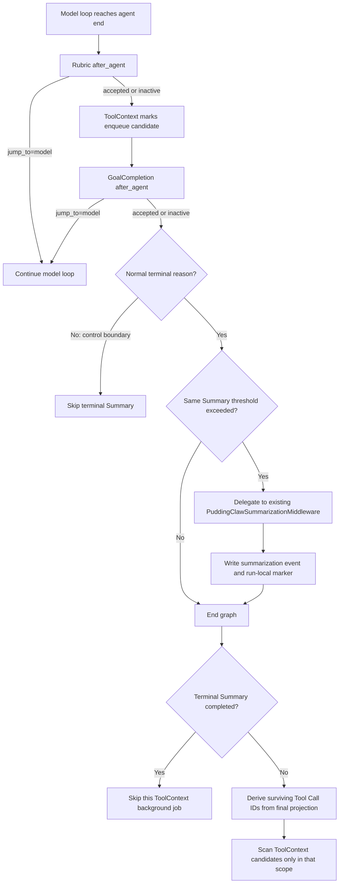

# DeepAgents Agent 终态 Summary 与中间件顺序评审方案

> 状态：Review Draft，仅用于方案评审，尚未修改运行逻辑
>
> 日期：2026-08-14
>
> 适用范围：PuddingClaw DeepAgents 主 Agent
>
> 不适用范围：旧 Chat 链路；SubAgent 首版不增加终态 Summary 触发
>
> 核心结论：保留现有 `PuddingClawSummarizationMiddleware` 作为唯一全局压缩实现，只增加一个 after-agent 协调 hook；终态 Summary 成功时不再触发本次后台 Tool Context 压缩，其他情况只允许 Tool Context 处理最终有效模型投影中仍存活的 Tool Call。

## 0. 评审摘要

当前全局 Summary 只在 `wrap_model_call` / `awrap_model_call` 边界检查阈值。它可以在同一 Run 的模型与工具循环中压缩，但存在一个终态盲区：最终 Assistant 回复生成后，如果上下文才越过阈值，且本 Run 不再发生下一次模型调用，本 Run 不会立即压缩，前端最终 token usage 可能超过阈值，压缩要等到下一 Run 的第一次模型调用才发生。

建议增加一次 **Agent 被 Rubric 和 GoalCompletion 接受后的终态检查**，并满足以下约束：

1. 不增加第二套 compact 算法、摘要 Prompt、切分策略或持久化协议。
2. 终态 hook 委托同一个 `PuddingClawSummarizationMiddleware` 实例执行。
3. Rubric 或 GoalCompletion 决定 `jump_to="model"` 时，不进行终态 Summary。
4. 正常结束时若终态 Summary 成功，本次不再排队 Tool Context 后台压缩。
5. 若 Summary 发生在模型循环中途，不能仅凭“本 Run 已 Summary”跳过 Tool Context；Summary 之后可能又产生新 ToolMessage，后台候选必须收窄到最终有效投影仍包含的 Tool Call。
6. Tool Context 的单条结果即时保护继续保留，它发生在 `awrap_tool_call`，职责不同。
7. Summary 失败不得把原本成功的 Agent Run 改成失败；保留原上下文并记录维护错误。
8. 终态压缩完成后重新计算并发送 `context_usage`，前端最终值应反映压缩后的模型投影。
9. ToolExecution 的控制性 `jump_to="end"` 会进入而不是跳过 after-agent 链；授权等待、授权失败和 Skill 确认取消必须显式标记为非正常终态，并跳过终态 Summary。
10. 终态 Summary 在 graph 内同步完成，以换取 state、Trace 与 Session projection 的一致提交；接受仅在越阈值 Run 出现的完成状态尾延迟，并显式展示 maintenance 状态。

本方案只增加一个触发点，不增加一种压缩方法：

```text
现有：每次模型调用前 -> 同一个 Summary middleware 检查并按需压缩
新增：Agent 真正结束后 -> 同一个 Summary middleware 再检查一次并按需压缩
```

### 0.1 本轮源码复核裁决

| 复核项 | 裁决 | 文档处理 |
| --- | --- | --- |
| inventory 的默认 Todo 错误 | 接受纠正 | inventory 只错误展示了被排除的默认 Summary；另补充 HarnessTodo 真实位置错误 |
| `_build_middlewares()` 与主构建段混写 | 接受 | 第 2.2 节明确 1-23 与 24-26 的构造边界及 hook 插入方式 |
| ToolExecution `aafter_agent jump_to=end` 会跳过后续 hook | 机制描述不成立，但发现的控制出口风险成立 | 实际是 `before_model/after_model jump_to=end`，会进入 after-agent 链；新增 exit reason 并让 terminal Summary 跳过 |
| 未声明 state key 会静默丢弃 | 接受 | 新增 resolved state channel 回归测试，所有 marker 显式进入 `PuddingClawAgentState` |
| after-agent 改 messages 必须使用 `REMOVE_ALL_MESSAGES` | 作为防回归约束接受，现状描述需修正 | DeepAgents 当前通过 `_summarization_event` 投影，不直接替换 messages；首版继续走 event 协议 |
| 终态 skip 与 recent tail 有张力 | 接受 | 第 8.4 节记录两种策略，首版明确选择 keep-recent fidelity policy 并增加 surviving-tool 指标 |
| 终态 Summary 有用户可感知尾延迟 | 接受 | 第 10.3 节对比同步/异步，首版选择 graph 内同步并量化 P95 |
| after-agent 缺少 `ModelRequest` 基线 | 接受并提升为 P0 | 缓存最后一次 Summary 边界 request，以 final messages/state 覆盖；terminal sink 复用同实例上游编排 |

---

## 1. 第一性原理

### 1.1 Compact 的对象是模型投影，不是产品历史

全局 Summary 只能改变下一次模型调用看到的消息投影：

```text
原始 transcript / control plane / evidence ledger
                    |
                    v
        有界的 Model Messages Projection
```

它不能删除或覆盖：

- Session 中用户可见的原始对话；
- Goal、Run、Todo、Permission 等控制面事实；
- Tool Call 与 Tool Result 的 Evidence 身份；
- 正式交付 Artifact 和验证 receipt。

### 1.2 触发点和压缩算法必须分离

“模型调用前检查”和“Agent 结束后检查”是两个触发时机，不应演变成两套实现。

唯一的压缩 owner 仍是：

```python
PuddingClawSummarizationMiddleware
```

终态 hook 只负责回答三个问题：

1. Agent 是否已经被所有终态 Gate 接受；
2. 当前有效模型投影是否超过同一个 Summary 阈值；
3. 本 Run 是否已经完成过全局 Summary。

摘要 Prompt、保留 token、cutoff、协议过滤、历史 offload、`_summarization_event` 和 Session Summary projection 都继续复用现有实现。

### 1.3 同一终态只做一种历史上下文维护

全局 Summary 和后台 Tool Context 压缩都可能减少下一 Run 的历史输入，但粒度不同：

- **Global Summary**：把旧消息整体替换为摘要与最近消息；
- **Tool Context background compaction**：为仍会进入下一 Run 的历史 ToolMessage 准备 `context_output`。

Global Summary 会让被摘要区间内的旧 ToolMessage 退出有效模型投影，但通常仍会保留一个 recent tail。模型循环中途 Summary 后，也可能继续执行工具并产生新的 ToolMessage。因此“本 Run 发生过 Summary”本身不足以证明所有 Tool Context 工作都没有价值。

当前候选扫描读取的是整个持久化 transcript，而不是 Summary 后的有效模型投影，因此仍可能找到已经不会再进入模型的旧结果，产生无意义扫描、Job 和摘要模型调用。这里需要同时解决两个问题：

1. 终态 Summary 已把最终上下文降回预算内时，不在同一终态再启动 Tool Context Job；
2. 没有终态 Summary、但此前发生过模型边界 Summary 时，只处理最终有效投影中仍存活的 Tool Call，不能扫描已经被 Summary 淘汰的历史结果。

所以终态规则应为：

```text
after-agent 终态 Summary 成功 -> 跳过本次后台 Tool Context compaction
仅发生过 model-boundary Summary -> 只压缩最终有效投影中的候选 Tool Call
未发生 Summary -> 最终有效投影等于正常历史投影，按现有候选规则运行
```

---

## 2. 当前全局中间件拓扑

### 2.1 DeepAgents 基础层

`create_deep_agent()` 先构造基础中间件，再追加 PuddingClaw 传入的 user middleware。当前 Harness Profile 排除了默认 `TodoListMiddleware` 和默认 `SummarizationMiddleware`，并追加 `HarnessTodoMiddleware`。

主 Agent 的逻辑顺序为：

```text
DeepAgents base
  SkillsMiddleware（配置了 skills 时）
  FilesystemMiddleware
  SubAgentMiddleware（配置了 inline subagents 时）
  PatchToolCallsMiddleware

PuddingClaw user middleware
  见 2.2

Harness profile extras
  HarnessTodoMiddleware

Provider / runtime tail
  Tool exclusion（配置时）
  Prompt caching middleware（Provider 支持时）
  Memory / HITL tail（对应参数启用时）
```

注意：运行时 inventory 当前有两处已确认的不一致：

1. 硬编码展示了已被 Harness Profile 排除的默认 `SummarizationMiddleware`；
2. 把 `HarnessTodoMiddleware` 展示在 stack 首位，但真实位置是 PuddingClaw user middleware 之后的 Harness profile extras。

inventory 没有展示默认 `TodoListMiddleware`，因此不存在“被排除的默认 Todo 仍显示”这一问题。实现阶段应让 inventory 反映最终 materialized stack，而不是继续维护一份手写顺序。

### 2.2 PuddingClaw 主 Agent user middleware 挂载顺序

以下表格合并展示两段代码形成的最终 PuddingClaw user middleware 前向顺序，但两段构造必须明确区分：

- 序号 1 至 23 由 `deepagents_manager.py::_build_middlewares()` 返回；
- 序号 24 至 26 在主 Agent 构建段单独追加，其中 `PuddingClawSummarizationMiddleware` 此时才被创建。

这一区分直接约束终态 hook 的落点：hook 需要引用主 Summary 实例，因此不能在 `_build_middlewares()` 内凭空构造。主 Agent 构建段应先创建主 Summary，再把协调 hook 插入已返回列表中 `GoalCompletionMiddleware` 的前方，最后按现状追加主 Summary、ToolProtocolIntegrity 和 UserAgentsPrompt。可选项仅在对应配置开启时存在。

| 前向序号 | Middleware | 主要 hook / 职责 | 与终态 Summary 的关系 |
| ---: | --- | --- | --- |
| 1 | `EvaluationToolBoundaryMiddleware`（可选） | 评测工具边界 | 无直接影响 |
| 2 | `MemoryMiddleware` | System / Memory 投影 | 影响 token 计数和 Prompt Cache 前缀 |
| 3 | `RunScopeMiddleware` | Run 作用域 | 提供运行身份 |
| 4 | `AttachmentAuthorityBoundaryMiddleware`（可选） | 附件只读/权威边界 | 无直接影响 |
| 5 | `AnalysisTemplateMiddleware`（可选） | 分析模板 | 影响模型请求内容 |
| 6 | `SemanticAssetsMiddleware`（可选） | 语义资产 | 影响模型请求内容 |
| 7 | `ExternalFilePermissionMiddleware` | 外部文件权限 | 不应由 Summary 改变 |
| 8 | `WorkspacePathRouterMiddleware` | 工作区路径路由 | 不应由 Summary 改变 |
| 9 | `VerificationActivationMiddleware` | 验证能力激活 | 影响终态验证条件 |
| 10 | `VersionedPatchMiddleware`（可选） | 版本化写入 | 无直接影响 |
| 11 | `AttachmentEditMiddleware`（可选） | 附件编辑 | 无直接影响 |
| 12 | `DelegationControlMiddleware` | 委派约束 | 无直接影响 |
| 13 | `GoalCompletionMiddleware` | `after_agent`；可 `jump_to=model` | 必须先于终态 Summary 作出接受决定 |
| 14 | `UserInputBoundaryMiddleware` | 用户输入边界 | 影响模型消息投影 |
| 15 | `SkillIntentRouterMiddleware` | Skill 意图路由 | 影响模型请求和工具面 |
| 16 | `RequiredSkillBoundaryMiddleware` | 必需 Skill 边界 | 不应被 Summary 绕过 |
| 17 | `ToolsetMiddleware` | Tool schema / capability 投影 | 影响 token 计数 |
| 18 | `ToolGuideMiddleware` | 渐进 Tool Guide | 影响 System Prompt 和 token 计数 |
| 19 | `ToolExecutionPipeline` | 工具执行、权限与 HITL；`before_model/after_model` 可 `jump_to=end` | 控制性结束会进入 after-agent 链，必须标记退出原因 |
| 20 | `LargeToolResultOffloadMiddleware` | 大结果外置 | 与 Summary 协作，保留稳定引用 |
| 21 | `ToolContextCompactionMiddleware`（可选） | tool call 即时保护；`after_agent` 设置后台入队标记 | 终态 Summary 成功时按 keep-recent policy 取消本次后台入队 |
| 22 | `PuddingClawRubricMiddleware`（可选） | `after_agent`；可 `jump_to=model` | 必须先于 Goal 和终态 Summary 执行 |
| 23 | `ObservableModelCallLimitMiddleware`（可选） | 模型调用熔断 | 终态 Summary 不应消耗主 Agent 调用预算 |
| 24 | `PuddingClawSummarizationMiddleware`（可选） | `wrap_model_call`；唯一全局压缩实现 | 保持原位置和现有模型边界行为 |
| 25 | `ToolProtocolIntegrityMiddleware` | 最后模型边界协议修复、`context_usage` | 终态结果也必须保持协议闭合并更新 usage |
| 26 | `UserAgentsPromptMiddleware`（可选） | 用户 Home Prompt | 影响最终 System Prompt |

`ordered_system_sections` 开启时，`MemoryMiddleware` 可能被移动到 Semantic Assets 后面，以稳定 Prompt Cache 前缀。评审和测试不应只断言固定序号，而应断言关键相对顺序。

### 2.3 不同 hook 的执行方向

LangChain 中间件不是所有 hook 都按同一方向执行：

```text
before_agent / before_model          按列表前向执行
wrap_model_call                      列表前项在外层，调用 handler 后进入下一项
after_model / after_agent            按列表逆向执行
```

`after_agent` 中一旦某个 hook 返回 `jump_to="model"`，后续尚未执行的 after-agent hook 会被跳过，并重新进入模型循环。

因此，中间件“挂载在谁前面”会决定它在 after-agent 阶段“在谁后面执行”。

`jump_to="end"` 的语义需要单独说明：从 `before_model` 或 `after_model` 发出时，LangChain 的 `end_destination` 是 after-agent 入口（存在 after-agent middleware 时），不是直接的 graph `END`。因此它会结束模型循环，但仍会经过完整 after-agent 链。

---

## 3. 当前 after-agent 实际顺序及影响

只列出当前实现中真正定义了 after-agent hook、且与本方案有关的节点。按实际执行顺序为：

```text
1. PuddingClawRubricMiddleware.aafter_agent    （配置时）
2. ToolContextCompactionMiddleware.aafter_agent（配置时，只写 enqueue=True）
3. GoalCompletionMiddleware.aafter_agent
```

### 3.1 `PuddingClawRubricMiddleware`

职责：

- 读取当前 Run 的 verification contract；
- 先做 deterministic completion gate；
- 再做 Rubric 评估；
- 需要返工时返回 `jump_to="model"`。

影响：如果 Summary 在 Rubric 前执行，就可能先压缩一份尚未被接受、马上要返工的候选答案。这样既浪费摘要调用，也可能让下一轮修复丢失必要细节。

结论：终态 Summary 必须在 Rubric 之后。

### 3.2 `ToolContextCompactionMiddleware`

它有两类行为，不能一起关闭：

1. `awrap_tool_call`：单条工具结果超过阈值时的当前轮即时保护；
2. `aafter_agent`：只返回 `{"tool_context_enqueue": true}`，真正候选扫描和压缩在 graph 结束后由 manager 调度。

影响：终态 Summary 已成功时，第 2 类行为本次没有必要；模型循环中途 Summary 后仍可能有新 ToolMessage，不能仅凭 Run 级 Summary bool 永久抑制第 2 类行为。第 1 类始终有必要，因为它保护的是当前模型调用。

结论：终态 Summary 成功时抑制本次后台 enqueue；其他情况把后台候选限制在最终有效投影，不移除 middleware，也不关闭即时保护。

### 3.3 `GoalCompletionMiddleware`

职责：标准 Goal Run 在没有结构化完成声明时追加 reminder，并返回 `jump_to="model"`。

影响：如果 Summary 在 GoalCompletion 前执行，可能压缩一份被 Goal Gate 拒绝的“完成答复”。

结论：终态 Summary 必须在 GoalCompletion 之后。

### 3.4 当前顺序中的另一个问题

ToolContext hook 目前先把 `tool_context_enqueue=True` 写入 state，GoalCompletion 随后可能 `jump_to=model`。这通常不会立即启动 Job，因为 manager 尚未结束 graph，但标记会在后续 state 中继续存在。

本方案不依赖通过调整 ToolContext hook 顺序解决问题，而是在最终调度层使用明确的 Summary source 和最终有效 Tool Call 集合做仲裁。正常、取消和异常出口共享候选作用域规则；只有正常结束且终态 Summary 成功时直接抑制本次 enqueue。

### 3.5 `ToolExecutionPipeline` 的控制性结束

`ToolExecutionPipeline` 当前没有 `after_agent` hook。它在以下位置声明 `can_jump_to=["end"]`：

- `before_model`：Skill 安装确认被取消；
- `after_model`：托管授权等待用户浏览器操作、授权流程失败，或阻止模型继续发起依赖工具调用。

这些 jump 会路由到 after-agent 入口，所以 Rubric、ToolContext、GoalCompletion 和新增 terminal Summary hook 仍可能执行。它们不是“正常答案被接受”的终态，不应因为经过了 after-agent 就运行终态 Summary。

建议 `ToolExecutionPipeline` 在 jump update 中同时写入私有状态：

```python
_terminal_exit_reason: Literal[
    "skill_confirmation_cancelled",
    "managed_authorization_waiting",
    "managed_authorization_failed",
]
```

terminal Summary hook 发现 `_terminal_exit_reason` 时跳过并记录 Trace。这样“正常退出路径上的最后一个 hook”与“任何 graph 结束都会执行的 finally”得到清晰区分。

---

## 4. 为什么不能直接给现有 Summary 增加 `after_agent`

当前 `PuddingClawSummarizationMiddleware` 位于 user middleware 尾部，晚于 Rubric、ToolContext 和 GoalCompletion 的前向挂载位置。由于 `after_agent` 逆序执行，如果直接在它上面实现 `aafter_agent`，执行顺序将变成：

```text
Summary after_agent
-> Rubric
-> ToolContext
-> GoalCompletion
```

这正好违反终态 Gate 的要求：Summary 会在 Rubric 和 GoalCompletion 接受答案之前运行。

也不能简单把主 Summary middleware 整体移动到 GoalCompletion 前面。移动会同时改变它的 `wrap_model_call` 嵌套位置，使 token 统计和压缩输入发生变化，可能绕开或提前于 UserInput、Skill、Toolset、ToolGuide、Tool Context 等请求变换，并影响 Prompt Cache 行为。

因此应保持主 Summary 的现有挂载位置，只增加一个独立的 **触发协调层**。协调层不是新的 compact 方法，它只持有同一个 Summary 实例的引用。

---

## 5. 建议拓扑

### 5.1 新增协调中间件

建议工作名：

```python
PuddingClawTerminalSummaryHookMiddleware
```

建议插入在前向列表的：

```text
DelegationControlMiddleware
PuddingClawTerminalSummaryHookMiddleware   <- 新增
GoalCompletionMiddleware
UserInputBoundaryMiddleware
...
PuddingClawRubricMiddleware
...
PuddingClawSummarizationMiddleware         <- 原实例、原位置
ToolProtocolIntegrityMiddleware
```

这样 after-agent 逆序为：

```text
PuddingClawRubricMiddleware
ToolContextCompactionMiddleware
GoalCompletionMiddleware
PuddingClawTerminalSummaryHookMiddleware
```

Rubric 或 GoalCompletion 返回 `jump_to="model"` 时，终态 Summary hook 不会执行。在普通模型退出路径上，它是 Rubric 与 Goal Gate 之后的最后一个 after-agent hook；但它不是 finally。ToolExecution 的控制性 `jump_to="end"` 也会进入 after-agent 链，因此还必须通过 `_terminal_exit_reason` 排除授权等待、授权失败和确认取消等非正常终态。

### 5.2 委托关系



协调 hook 不得复制以下代码：

- Summary Prompt；
- `_determine_cutoff_index()`；
- `_filter_summary_messages()`；
- Harness envelope 清理；
- history offload；
- `_summarization_event` 构造；
- Summary projection 序列化。

协调层需要提供一个终态委托方法。它接受“终态投影”而非真实模型调用：以实例缓存的当前 Run 最后一次到达 **主 Summary 边界** 的 `ModelRequest` 为基线（提供 System、Tools、state 和 runtime context），再以 final state 覆盖 `messages` 与 state。基线缓存不是可选的省事方案，而是终态触发在计数口径上等价于现有 Summary 边界触发的前提，属于 P0 设计点，详见 6.4。不能自行拼造一套 System、Tools 和 runtime context。

当前 DeepAgents 没有公开的“只准备 Summary state update”入口，完整编排位于上游 `awrap_model_call`。本地首版不应复制这段私有流程。推荐由协调 hook 调用 **同一个 Summary middleware 实例的 `awrap_model_call`**，但提供一个不调用主 Agent model 的 terminal sink；随后只提取 `ExtendedModelResponse.command.update` 写回 state。核心产物仍是 `_summarization_event`，不是改写后但无人消费的 `ModelRequest`。详见 6.4。

当前 DeepAgents 提供的 `SummarizationToolMiddleware` 不是本方案替代品。它复用 Summary 引擎，但只注册手动 `compact_conversation` 工具，不提供 after-agent 自动触发。

---

## 6. 终态触发算法

### 6.1 前置条件

终态 hook 仅在以下条件同时满足时工作：

1. 当前 graph 正准备正常结束；
2. Rubric 未要求返工；
3. GoalCompletion 未要求补交结构化完成声明；
4. `_terminal_exit_reason` 为空，即不是授权等待、授权失败或确认取消等控制边界；
5. 当前 state 没有未闭合、可执行的 Tool Call；
6. 主 Summary middleware 已启用；
7. 主 Summary 实例持有当前 Run 的有效 `ModelRequest` 基线（见 6.4）；
8. 当前有效上下文达到现有 Summary trigger；
9. 本 Run 当前尚未完成同一最终投影的 Summary。

### 6.2 建议伪代码

```python
async def aafter_agent(state, runtime):
    if state.get("_terminal_exit_reason"):
        return None
    if pending_executable_tool_call_ids(state["messages"]):
        return None

    input_fingerprint = terminal_summary_input_fingerprint(state, runtime)
    if (
        state.get("terminal_summary_compacted")
        and state.get("_terminal_summary_input_fingerprint") == input_fingerprint
    ):
        return None

    try:
        # 内部使用实例缓存的最后一次 Summary 边界 ModelRequest（见 6.4），
        # messages 与 state 都以 final state 覆盖
        update = await main_summary.compact_if_needed_after_agent(
            state=state,
            runtime=runtime,
        )
    except Exception as exc:
        emit_context_maintenance_error(exc)
        return None

    if not update:
        return None

    return {
        **update,
        "summary_compacted_this_run": True,
        "terminal_summary_compacted": True,
        "summary_compaction_source": "after_agent",
        "_terminal_summary_input_fingerprint": input_fingerprint,
    }
```

模型调用边界发生 Summary 时，也必须记录本 Run 事件，但 source 为：

```text
model_boundary
```

### 6.3 幂等性

`summary_compacted_this_run` 只用于观测，不能作为 terminal hook 的跳过条件。模型循环中途 Summary 后可能继续新增 ToolMessage 或最终 Assistant 回复，终态仍需重新计算阈值。幂等必须绑定 terminal input fingerprint，并沿用现有 `_summarization_event` 的边界/摘要身份，确保相同终态投影不会被二次摘要。

最低要求：

- 同一 Run、同一 final messages fingerprint 只压缩一次；
- Rubric 或 Goal 返工后产生了新消息，可以在最终真正结束时重新判断阈值；
- 同 Run checkpoint resume 不重复执行已经完成的维护；
- 跨 Run 恢复不把旧 Run 的 marker 当成本 Run 已压缩。

terminal input fingerprint 应在执行 Summary 前计算，至少覆盖：

```text
run_id + system_message + ordered tool schemas + pre-terminal effective messages
```

序列化必须确定性，并排除 `summary_compacted_this_run`、`terminal_summary_compacted`、fingerprint 自身和 Trace 时间戳等维护字段，避免 state update 反过来改变自己的幂等键。只 hash raw `state["messages"]` 不够，因为已有 `_summarization_event` 时真正进入阈值判断的是 effective messages。

### 6.4 ModelRequest 基线缓存（P0 设计点）

终态阈值判断的输入是完整模型投影，不只是消息列表：

```text
used_tokens = token_counter(System + Tools + Messages)
```

`aafter_agent(state, runtime)` 拿不到 `ModelRequest`：System 和 Tools 是 Memory、ToolGuide、Toolset、UserAgentsPrompt 等中间件在每次模型调用前逐层变换出来的，state 中不存在这份拼装结果。两条回避路径都不可接受：

- **只用 messages 计数**：系统性少算 System + Tools 分量，终态触发与模型边界触发口径不一致，可能漏触发，前端 usage 也对不上；
- **在 hook 里重新拼装 System/Tools**：等于复制整条中间件链的请求构造逻辑，上游任何一个 middleware 变更都会让 hook 静默漂移（5.2 已禁止）。

因此终态检查的推荐输入是：**主 Summary 实例在每次 `wrap_model_call` / `awrap_model_call` 进入时缓存当前 Run 最后一次到达 Summary 边界的 `ModelRequest` 模板，终态委托借用其中的非消息部分，并用 final state 同时覆盖 messages 与 state**。要求：

1. 基线按 Run 隔离缓存，跨 Run 不保留，新 Run 首次模型调用前基线为空；
2. `request.messages` 和 `request.state` 必然过期（最后一次模型调用后还会追加最终 Assistant 回复，工具循环中也可能新增 ToolMessage），两者都必须由 final state 覆盖；
3. System / Tools 使用最后一次 Summary 边界实际看到的值，不声称它是 `ToolProtocolIntegrityMiddleware` 或 `UserAgentsPromptMiddleware` 内层变换后的 provider 最终请求。首版保持与现有 Summary trigger 相同的边界口径，避免顺手改变阈值语义；
4. 缓存必须绑定 `run_id`。终态 runtime 的 `run_id` 不匹配、基线缺失或当前 Run 从未发生模型调用时，跳过终态检查并记录原因；
5. Trace 记录基线捕获时的 message count、终态 message count 和 run identity，便于发现错误复用；
6. 该基线同时是 10.2 终态 `context_usage` 重算（System + Tools + Summary + kept recent）的输入来源，两处共用同一份快照，保证压缩判断与 usage 口径一致。

本地首版推荐使用 terminal sink adapter：

```python
async def compact_if_needed_after_agent(state, runtime):
    request = self._terminal_request_from_cached_template(state, runtime)

    async def terminal_sink(_request: ModelRequest) -> ModelResponse:
        # Summary middleware 仍会完整执行阈值、cutoff、offload 和摘要；
        # sink 只替代正常路径末端的主 Agent provider 调用。
        return ModelResponse(result=[])

    # 调用同一实例的 DeepAgents Summary 编排，但不再次进入
    # PuddingClaw 的“真实模型边界缓存”包装层。
    result = await super().awrap_model_call(request, terminal_sink)
    if not isinstance(result, ExtendedModelResponse) or result.command is None:
        return None
    return dict(result.command.update or {})
```

这个 adapter 的性质是“复用同一个 middleware，替换其下游模型节点”，不是第二套 compact：

1. below threshold 时 middleware 调用 sink 并返回普通空 `ModelResponse`，终态 hook 判定为 no-op；
2. above threshold 时 middleware 原样执行 effective messages、token count、cutoff、history offload、summary model 和 `_summarization_event` 构造；
3. sink 不调用主 Agent model，不增加主模型轮次；
4. hook 只接受 command update，不使用空 model response 作为业务回复；
5. terminal adapter 不得覆盖“最后一次真实模型边界”的 request cache；否则 checkpoint replay 或诊断会把维护请求误当真实 provider 请求；
6. PuddingClaw 的 `_SUMMARIZATION_USAGE_CONTEXT` 和 maintenance event 仍需包住这次 `super().awrap_model_call`，保证现有观测不丢失；
7. 若上游未来公开 preparation API，再迁移到公共 API，删除 adapter，不在本地长期 fork 上游算法。

---

## 7. Run 内状态与持久化边界

### 7.1 新增瞬态状态

建议在 Agent state 中增加：

```python
summary_compacted_this_run: NotRequired[bool]
terminal_summary_compacted: NotRequired[bool]
summary_compaction_source: NotRequired[Literal["model_boundary", "after_agent"]]
_terminal_summary_input_fingerprint: NotRequired[Annotated[str, PrivateStateAttr]]
_terminal_exit_reason: NotRequired[Annotated[str, PrivateStateAttr]]
```

语义：

- `summary_compacted_this_run` 表示当前 Run 是否成功完成过全局 Summary，仅用于观测和 manager 决策输入，不单独承担幂等；
- `terminal_summary_compacted` 只表示最终有效投影是否在 accepted after-agent 阶段完成 Summary，它才允许直接抑制本次 ToolContext Job；
- `_terminal_summary_input_fingerprint` 绑定最后一次终态 Summary 的实际输入，防止 checkpoint replay 重复压缩；模型边界 Summary 不写该字段；
- `_terminal_exit_reason` 标记 ToolExecution 触发的控制性结束，terminal Summary 据此跳过；
- 可进入同 Run LangGraph checkpoint，支持同 Run resume；
- 不作为跨 Run Session authority；
- 新 Run 初始化必须回到 false/缺失；
- 不能通过读取历史 `_summarization_event` 推断本 Run marker。

以上字段必须显式加入 `PuddingClawAgentState`。LangGraph 对未知 channel 的写入只记录 warning 并忽略，不会抛出阻止开发的异常；漏声明会表现为 marker 静默丢失、幂等和 ToolContext 仲裁偶发失效。因此“字段进入 resolved state channels”必须是独立回归测试，而不能只测试 middleware 返回了 dict。

### 7.2 为什么不能只检查 `_summarization_event`

`_summarization_event` 是压缩后的模型投影事件，可能来自：

- 当前 Run 的模型边界 Summary；
- 当前 Run 的终态 Summary；
- Session Summary projection 恢复；
- 同 Run checkpoint 恢复。

直接判断 `isinstance(final_state.get("_summarization_event"), dict)` 无法区分“当前 Run 新发生”与“恢复了旧投影”。ToolContext 互斥必须依赖本 Run marker，不能误把跨 Run 已有 Summary 当作本 Run 刚完成的维护。

### 7.3 Messages reducer 与 Summary state update

当前 PuddingClaw 继承的是 DeepAgents `_DeepAgentsSummarizationMiddleware`。它在 `wrap_model_call` 中不直接替换 LangGraph 的原始 `messages`，而是写 `_summarization_event`；后续 `_get_effective_messages()` 用 `summary_message + messages[cutoff_index:]` 构造模型投影。终态共享入口必须保持这一事件协议。

因此首选 state update 是：

```python
{
    "_summarization_event": new_event,
    "summary_compacted_this_run": True,
    "terminal_summary_compacted": True,
    "summary_compaction_source": "after_agent",
    "_terminal_summary_input_fingerprint": input_fingerprint,
}
```

不要在终态 hook 中直接返回一份“完整替换后的 messages”。如果未来确实需要重写整个 messages channel，DeepAgents 的 reducer 要求使用：

```python
{
    "messages": [
        RemoveMessage(id=REMOVE_ALL_MESSAGES),
        *replacement_messages,
    ]
}
```

否则 `messages` reducer 会把新列表追加/按 ID 合并到旧 state，而不是整体替换。该规则是防回归边界，不是本方案首版的数据路径。

### 7.4 Manager 本地观测

正常、取消、异常出口并不总能可靠拿到相同形态的 `final_state`。建议 manager 在处理 graph stream 时维护本地变量：

```python
summary_compacted_this_run = False
terminal_summary_compacted = False
active_tool_call_ids: set[str] = set()
```

当收到当前 Run 新产生的 summarization event 或明确的 summary marker 时更新 source；每次 values state 更新时，从 `_effective_agent_messages()` 计算仍在最终模型投影中的 `tool_call_id` 集合。以上变量只存在于本次 SSE generator 生命周期。

---

## 8. Tool Context 互斥策略

### 8.1 保留的行为

以下行为保持不变：

- `ToolContextCompactionMiddleware.awrap_tool_call()` 的单条即时保护；
- `LargeToolResultOffloadMiddleware` 的大结果无损外置；
- 已经生成的 `context_output`、`raw_output_ref` 和 compaction metadata；
- 未发生终态 Summary 时，针对最终有效投影的 after-agent 后台候选扫描；
- Tool Context Job 的 CAS、失败降级和 Evidence 完整性。

### 8.2 抑制的行为

只抑制 graph 结束后的：

```python
tool_context_compaction_service.enqueue(...)
```

正常出口在 `terminal_summary_compacted=True` 时直接抑制。其余出口仍可进入候选扫描，但必须传入最后已知有效模型投影中的 Tool Call ID 集合：

1. 正常结束；
2. 用户取消；
3. Run 异常。

建议统一成一个调度决策函数，避免三处分支逐渐漂移：

```python
def decide_tool_context_maintenance(
    *,
    enabled: bool,
    requested: bool,
    terminal_summary_compacted: bool,
    active_tool_call_ids: set[str],
) -> ToolContextDecision:
    if not enabled or not requested:
        return ToolContextDecision.skip("disabled_or_not_requested")
    if terminal_summary_compacted:
        return ToolContextDecision.skip("terminal_summary_completed")
    if not active_tool_call_ids:
        return ToolContextDecision.skip("no_active_tool_results")
    return ToolContextDecision.enqueue(eligible_tool_call_ids=active_tool_call_ids)
```

取消和异常路径当前没有来自 `aafter_agent` 的 `tool_context_enqueue` 也会直接尝试 enqueue。这里的 `requested` 可按现有语义视为 true；它们不会主动运行终态 Summary，因此不使用终态互斥，但应使用最后已知的有效 Tool Call scope，避免处理早已被模型边界 Summary 淘汰的历史结果。拿不到可靠 scope 时应选择不启动 Job 并记录原因，而不是回退到全 transcript 扫描。

`ToolContextCompactionService.enqueue()` 和 `select_tool_context_candidates()` 需要新增可选的 `eligible_tool_call_ids` 参数。候选必须同时满足现有规则和作用域规则。该集合只决定哪些 Tool Result 仍值得为未来模型投影准备 `context_output`，不改变原始 transcript 或 Evidence。

### 8.3 不建议的实现

不建议让终态 Summary hook 返回：

```python
{"tool_context_enqueue": False}
```

作为唯一互斥手段，原因是：

- state reducer/后续 hook 可能再次覆盖；
- 取消和异常出口未必使用同一个 final state；
- 无法区分“未请求”“终态 Summary 抑制”和“最终投影已无 Tool Result”；
- Trace 难以解释为什么没有创建 ToolContext Job。

应保留 enqueue 请求事实，再由 manager 根据明确的 Summary source 和有效 Tool Call scope 做最终仲裁，并在 Trace 中记录 suppression reason。

### 8.4 终态 Summary 后跳过 ToolContext 的取舍

终态 Summary 仍可能保留 recent tail，其中也可能有尚未生成 `context_output` 的 ToolMessage。这里存在两个可行策略：

| 策略 | 优点 | 代价 |
| --- | --- | --- |
| 终态 Summary 后继续 scoped ToolContext | 下一 Run 更小，所有存活大结果都有机会压缩 | 同一终态连续做两次维护；增加模型成本和尾延迟；立即压缩 recent tail 会削弱 keep-recent 的保真语义 |
| 终态 Summary 后跳过本次 ToolContext（本方案） | 一次终态只做一种维护；recent tail 至少原样保留到下一 Run；完成延迟可控 | tail 中的大 ToolResult 暂时没有 `context_output`；即时压缩默认关闭时尤其明显 |

首版选择第二种策略，依据是：

1. Summary 的 keep window 本来就是为最近推理证据保真；
2. 终态 Summary 已把整体投影降回 trigger 以下，不存在立即爆窗风险；
3. 下一次未触发终态 Summary 的 Run 仍可对存活 Tool Call 做 scoped ToolContext；
4. 大于硬上限的结果仍由 `LargeToolResultOffloadMiddleware` 保护，ToolContext 即时保护也可由配置开启。

这不是“终态 Summary 后不存在 ToolMessage”的事实判断，而是一项明确的延迟/保真策略。Trace 应记录：

- `surviving_tool_call_count_after_terminal_summary`；
- `surviving_tool_tokens_after_terminal_summary`；
- `tool_context_suppression_reason=terminal_summary_keep_recent_policy`。

如果真实数据表明 recent tail 长期过重，再把策略切换为“终态 Summary 后仅对 surviving Tool Call scoped enqueue”，无需改变 Summary 算法或 Session 协议。

---

## 9. 与其他中间件的影响分析

### 9.1 Tool Protocol Integrity

终态 Summary 不能留下孤立 ToolMessage 或未闭合 Tool Call。终态检查前应拒绝 pending executable tool calls，压缩结果继续通过现有协议闭合序列化函数持久化。

`ToolProtocolIntegrityMiddleware` 当前位于主 Summary 之后的模型边界。终态委托应保持主 Summary 当前看到的 request 语义，不自行发起真实主模型调用，也不制造空 Tool Result。

### 9.2 Rubric 模型调用

Rubric 自己可能调用模型，但它不是主 Agent 的 Summary 输入，也不应被终态压缩计入主 Agent model-call limit。终态 hook 必须在 Rubric 接受后运行；Summary 使用 summary role model，保持现有计费和 Trace 归属。

### 9.3 GoalCompletion

GoalCompletion 的 reminder 属于需要继续执行的内部控制消息。旧 reminder 不应进入长期摘要，现有 `_without_internal_controls()` 和 Harness envelope 清理继续作为唯一过滤入口。

### 9.4 ObservableModelCallLimit

终态 Summary 是上下文维护，不是主 Agent 决策轮次：

- 不递增主 Agent model call count；
- 不触发 `jump_to=model`；
- 不消耗 Goal repair iteration；
- 仍应记录 summary model 的独立 usage/Trace。

### 9.5 ToolExecution control exit

`ToolExecutionPipeline.before_model/after_model` 的 `jump_to="end"` 会进入 after-agent 链。新增 hook 必须检查 `_terminal_exit_reason`，避免在以下路径运行终态 Summary：

- 等待用户在浏览器完成托管授权；
- 托管授权流程失败并结束本轮；
- 用户取消 Skill 安装确认。

这些路径仍可保留 ToolContext 的现有维护策略，但 manager 调度时必须使用最后可靠的 active Tool Call scope。测试需覆盖 `jump_to=end -> after-agent entry -> terminal Summary skipped` 的完整图路由，不只单测 hook 返回值。

### 9.6 Prompt Cache

新增 after-agent 触发不会提前改变本 Run 已完成的主模型请求，因此不会破坏本 Run 最终回复的 Prompt Cache。

Summary 成功后，下一 Run 的 Messages 前缀会合理变化为 Summary projection。这是 compact 的预期变化。System 和 Tools 的稳定性仍由现有 Prompt Cache 方案治理，终态 hook 不应重排 middleware 或重建工具 schema。

### 9.7 Session Summary projection

终态 Summary 产出的 `_summarization_event` 必须继续走现有：

```text
_effective_agent_messages
-> protocol-closed serialization
-> _summary_projection_parts
-> update_session_summary_projection
```

不能新增第二个 Session compact 字段，也不能回退到 legacy `compressed_context`。

### 9.8 Trace wrapper

`wrap_middlewares_for_trace()` 必须保留新 hook 的 `can_jump` 和 hook 元数据。Trace 至少展示：

- terminal summary check：skipped / below_threshold / compacted / failed；
- terminal exit reason：normal / managed_authorization_waiting / managed_authorization_failed / skill_confirmation_cancelled；
- trigger source：model_boundary / after_agent；
- used tokens before / after；
- ToolContext enqueue：requested / enqueued / suppressed；
- suppression reason：`terminal_summary_completed` / `no_active_tool_results`。

---

## 10. Token usage 与前端口径

### 10.1 当前问题

模型边界 `context_usage` 包含本次 Assistant 输出。最终回复使上下文越过阈值、又没有下一次模型调用时，UI 可能收到超过 100% 的 SSE percentage。REST 刷新虽然可以把 percentage clamp 到 100%，但这只是显示层掩盖，`used_tokens` 仍可能高于 trigger。

### 10.2 终态压缩后的正确口径

Summary 成功后，应基于压缩后的有效消息投影重新计算：

```text
System + Tools + Summary message + kept recent messages
```

然后发送新的 `context_usage`：

```json
{
  "type": "context_usage",
  "source": "after_agent_summary",
  "scope": "next_turn_effective_context",
  "used_tokens": 42000,
  "total_tokens": 160000,
  "percentage": 26.3,
  "measurement": "approximate"
}
```

该事件应覆盖 manager 的 `last_context_usage`，并用于：

- `run_agent_context` usage；
- `session_summary_projection.tokens_after`；
- 前端当前 Session 的最终上下文窗口显示；
- Trace 中的 before/after 对照。

如果 Summary 失败，保留真实的超阈值 usage，不伪造一个小于 100% 的值。

### 10.3 尾延迟与执行位置决策

终态 Summary 需要一次 summary model 调用。放在 graph 内意味着：

- 主 Agent 的最终文本已经通过 model stream 到达前端；
- 但 Run 的 completed、最终 context usage 和 Session Summary projection 要等摘要完成；
- 用户看到的是“答案已出现，但任务仍在做上下文维护”的尾延迟。

可选架构对比：

| 位置 | 一致性 | 用户体验 | 并发风险 |
| --- | --- | --- | --- |
| graph 内同步 after-agent（本方案） | state event、Trace、usage、Run 持久化同一提交路径 | 越阈值 Run 增加一次可见尾延迟 | 低；下一 Run 不会在旧 projection 上抢跑 |
| graph 结束后异步 | 最终回复最快结束 | maintenance 可能稍后完成 | 高；下一 Run、ToolContext Job 和 Session projection 写入可能竞态，需要额外租约/CAS |

首版选择 graph 内同步，因为 compact 是下一 Run 上下文正确性维护，不只是离线缓存。要求：

1. 复用现有 `context_maintenance` start/done/error 事件，让前端明确显示正在压缩；
2. 只在超过同一 Summary trigger 时产生尾延迟，below-threshold 检查不得调用摘要模型；
3. 使用 summary model 现有请求超时/取消语义，终态 hook 捕获失败并保留原 Run outcome；
4. Trace 分别记录 `answer_stream_finished_at`、`terminal_summary_started_at`、`terminal_summary_finished_at`，量化真实尾延迟；
5. 不在终态 Summary 后继续等待 ToolContext Job，这是 8.4 选择 skip policy 的另一个原因。

如果线上 P95 尾延迟不可接受，再评审 post-graph maintenance lease，而不是悄悄把同步 hook 改成无状态后台任务。

---

## 11. 失败与并发策略

### 11.1 Summary 失败

终态 Summary 是 best-effort maintenance：

- 不改变已经成功的 Run outcome；
- 不删除现有 messages；
- 不设置 `terminal_summary_compacted=True`；
- 允许 ToolContext 按原逻辑运行，因为 Global Summary 没有成功；
- 发送 `context_maintenance` error 并写 Trace；
- 下一 Run 的模型边界仍可再次尝试现有 Summary。

### 11.2 用户取消

取消时不新增 after-agent Summary。即使本 Run 在取消前的某个模型边界已经完成 Summary，仍可能存在 Summary 后的新工具结果；取消出口只允许处理最后已知有效投影中的 Tool Call。拿不到可靠投影时不做全 transcript 回退扫描。

### 11.3 Run 异常

异常时不主动对不完整 final state 做终态 Summary。异常出口与取消出口相同，只允许处理最后已知有效投影中的 Tool Call，避免模型边界 Summary 后又扫描已淘汰历史。

### 11.4 同 Session 并发 Run

marker 必须按 Run 隔离，不能存成 Session 级无版本 bool。ToolContext Job 仍沿用 Session 锁和幂等 Job 逻辑；Global Summary suppression 只针对产生该终态的 Run，不永久关闭 Session 的 ToolContext maintenance。

---

## 12. 实施步骤

### P0：建立同实例 Summary 终态委托

1. 不复制或 vendor DeepAgents `awrap_model_call` 内的阈值、cutoff、offload、摘要和 event 编排。
2. terminal hook 调用同一个 `PuddingClawSummarizationMiddleware.awrap_model_call` 实例，并传入不访问 provider 的 terminal sink。
3. 只从 `ExtendedModelResponse.command.update` 提取 state update，核心必须是 `_summarization_event`；普通 `ModelResponse` 表示 below-threshold no-op。
4. sink 的空 result 不进入 Agent messages，不作为业务回复，也不计入主 Agent model call count。
5. terminal adapter 不覆盖最后一次真实模型边界的 request cache，并保留 PuddingClaw maintenance/usage 观测。
6. 不引入新的 Summary middleware 实例，不直接重写原始 `messages`。
7. 为 adapter 写上游契约测试；DeepAgents 升级后若返回协议变化，测试必须失败而不是静默失效。

### P0：ModelRequest 基线缓存

1. 主 Summary 实例在每次模型边界调用时缓存当前 Run 最后一次到达 Summary 边界的 `ModelRequest` 模板，按 `run_id` 隔离，跨 Run 不保留。
2. 终态委托以“基线的 System / Tools / runtime + final state messages + final state”构造检查输入，不直接复用旧 `request.messages/state`。
3. 基线缺失、Run identity 不匹配或当前 Run 从未调用模型时跳过终态检查，Trace 记录原因，不影响 Run outcome。
4. 终态 `context_usage` 重算与阈值判断共用同一份基线快照。

### P0：增加终态协调 hook

1. 新增薄 `PuddingClawTerminalSummaryHookMiddleware`。
2. 在前向列表中插入到 `GoalCompletionMiddleware` 之前。
3. 引用主 Summary 实例；主 Summary 仍保留原挂载位置。
4. pending Tool Call 时跳过。
5. `_terminal_exit_reason` 非空时跳过。
6. 失败时吞掉维护异常并记录 Trace。

### P0：标记 ToolExecution 控制性结束

1. `ToolExecutionPipeline.before_model/after_model` 的 `jump_to=end` 同时写 `_terminal_exit_reason`。
2. 在 `PuddingClawAgentState` 声明该私有字段以及所有 Summary marker。
3. terminal Summary hook 仅接受 `_terminal_exit_reason` 为空的正常退出。
4. Trace 记录 control exit 经过 after-agent 但跳过 terminal Summary 的原因。

### P0：Global Summary 与 ToolContext 互斥

1. 增加 Run-local Summary source 和 terminal marker。
2. 模型边界与终态两种成功路径都记录 source，只有终态成功设置 terminal marker。
3. 从最终有效模型投影提取 active Tool Call ID scope。
4. ToolContext selector 只处理该 scope 内的候选。
5. 正常出口的终态 Summary 成功时直接抑制 enqueue；取消和异常出口只使用最后可靠 scope。
6. Trace 记录被抑制或收窄的 enqueue，而不是静默消失。

### P0：修正终态 token usage

1. Summary 成功后计算压缩后有效上下文。
2. 发送最终 `context_usage`。
3. 确保持久化使用压缩后的 `used_tokens`。

### P1：修正 runtime inventory

1. inventory 从最终 materialized middleware stack 生成或至少与 Profile exclusion 同源。
2. 不再展示被 Harness Profile 排除的默认 Summary；默认 Todo 当前未被 inventory 展示，无需修复不存在的问题。
3. 把 `HarnessTodoMiddleware` 展示在真实的 profile extras 位置。
4. 展示 terminal Summary hook 的真实位置和 hook 类型。

### P1：同步设计文档

实现通过评审后，应修订 `docs/tool-context-compaction-design.md` 中“与 DeepAgents 全局 summarize 独立工作”的表述：存储协议和算法独立，但同一 Run 的终态调度互斥。

---

## 13. 测试矩阵

### 13.1 中间件顺序

| 用例 | 断言 |
| --- | --- |
| 最终 materialized stack | 默认 Summary/Todo 已排除，Pudding Summary 仅一个实例 |
| 前向相对顺序 | terminal hook 在 GoalCompletion 前；主 Summary 保持在 ToolContext/Rubric 后 |
| after-agent 顺序 | Rubric -> ToolContext flag -> GoalCompletion -> terminal Summary |
| inventory | 与实际 materialized stack 一致 |
| state channels | Summary markers、terminal fingerprint 与 `_terminal_exit_reason` 均存在于 resolved state schema，写入后可从下一节点读取 |

### 13.2 终态触发

| 用例 | 预期 |
| --- | --- |
| final usage 低于阈值 | 不 Summary，不改变 ToolContext 调度 |
| final usage 高于阈值 | 复用主 Summary，产生 `_summarization_event` |
| 本 Run 中途已模型边界 Summary，final projection 再次越阈值 | 仍执行终态判断并可再次 Summary，不被 run-level bool 拦截 |
| Rubric `jump_to=model` | terminal hook 不执行 |
| GoalCompletion `jump_to=model` | terminal hook 不执行 |
| ToolExecution `before_model jump_to=end` | 路由进入 after-agent 链，但 terminal hook 因 control exit reason 跳过 |
| ToolExecution `after_model jump_to=end` | 路由进入 after-agent 链，但 terminal hook 因 control exit reason 跳过 |
| pending Tool Call | terminal hook 跳过 |
| 无有效 ModelRequest 基线或 Run identity 不匹配 | 跳过终态检查并记录原因，Run outcome 不变 |
| 基线 messages/state 与 final state 不同 | 使用 final state 覆盖，摘要包含最终 Assistant/ToolMessage |
| terminal sink 执行 | 不覆盖最后一次真实模型边界 cache，不产生主 Agent provider 调用 |
| Summary 抛错 | Run 仍成功，记录维护错误 |
| 同 final state 重放 | 不重复 Summary |
| terminal fingerprint 变化 | 允许对新的终态投影重新判断，不复用旧 terminal marker |
| terminal state update | 写 `_summarization_event`，不把 replacement messages 追加到原消息列表 |

### 13.3 ToolContext 互斥

| 用例 | 预期 |
| --- | --- |
| 模型边界 Summary 成功，之后无活跃 Tool Result | 不 enqueue ToolContext |
| 模型边界 Summary 成功，之后产生新 Tool Result | 只扫描新投影中仍存活的 Tool Call |
| after-agent Summary 成功 | 正常出口不 enqueue ToolContext |
| after-agent Summary 后 recent tail 含 ToolMessage | 本次仍按 keep-recent policy 跳过，并记录 surviving tool metrics |
| Summary 未触发 | 按现有规则 enqueue |
| Summary 失败 | 允许 enqueue |
| 取消前已模型边界 Summary | 只处理最后可靠投影中的 Tool Call |
| 异常前已模型边界 Summary | 只处理最后可靠投影中的 Tool Call |
| 取消/异常拿不到可靠 projection scope | 不回退扫描全 transcript |
| 即时 Tool Result 保护 | 不受互斥规则影响 |

### 13.4 持久化与恢复

| 用例 | 预期 |
| --- | --- |
| after-agent Summary 后开启新 Run | 从 `session_summary_projection` 恢复 |
| 恢复投影包含旧 `_summarization_event` | 不误判为本 Run 已 Summary |
| 同 Run checkpoint resume | marker 保留且不重复压缩 |
| `clear_messages` | 按现有规范同时清理 Summary projection，不留下错误 marker |

### 13.5 Token usage

| 用例 | 预期 |
| --- | --- |
| final output 使 usage 超阈值 | after-agent Summary 后发送较低 usage |
| Summary 未触发 | 最终 usage 等于真实有效投影 |
| Summary 失败 | 仍显示真实超阈值值，不伪造成功 |
| Session 刷新 | REST 与最后 SSE usage 一致 |

### 13.6 尾延迟与控制出口

| 用例 | 预期 |
| --- | --- |
| below-threshold 正常结束 | 不调用 summary model，不增加可测尾延迟 |
| above-threshold 正常结束 | 最终文本已流出；maintenance start/done 后再提交 Run completed |
| terminal Summary 超时/失败 | Run outcome 保持原结果，usage 保持真实未压缩值 |
| managed authorization waiting | 不运行 terminal Summary，等待用户继续授权 |
| Skill confirmation cancelled | 不运行 terminal Summary，保留控制边界原文 |

---

## 14. 评审决策项

请重点确认以下决策：

- [ ] 终态 Summary 只覆盖正常成功结束，不在取消/异常时主动运行。
- [ ] 终态 hook 插在前向 `GoalCompletionMiddleware` 之前，使其成为普通退出路径上的最后一个 after-agent hook；不把它描述成 finally。
- [ ] 保留主 Summary 的当前位置和模型调用边界行为。
- [ ] 终态 hook 只委托同一个 Summary 实例，不复制 compact 实现。
- [ ] 终态 hook 调用同一个 Summary middleware 实例和 terminal sink，只提取 `ExtendedModelResponse.command.update`；不复制上游 compact 编排、不直接重写 messages、也不调用主 Agent provider。
- [ ] 终态阈值检查以“缓存的最后一次 Summary 边界 `ModelRequest` 模板 + final messages/state”为输入，不用 messages-only 计数，也不重新拼装 System/Tools；基线缺失或 Run identity 不匹配时跳过并记录原因。
- [ ] `ToolExecutionPipeline jump_to=end` 写 `_terminal_exit_reason`，授权等待/失败和确认取消路径经过 after-agent 但跳过终态 Summary。
- [ ] 所有新增 marker 显式声明到 `PuddingClawAgentState`，测试 resolved state channel，不接受 unknown-channel warning。
- [ ] 正常结束且终态 Summary 成功时，跳过本次后台 ToolContext enqueue。
- [ ] 上述 skip 是 keep-recent fidelity policy，不是假设 recent tail 没有 ToolMessage；Trace 记录 surviving tool count/tokens。
- [ ] 仅发生模型边界 Summary 时，不做 Run 级 blanket skip；ToolContext 只扫描最终有效投影中的 Tool Call。
- [ ] 取消和异常出口不主动终态 Summary，也不回退扫描 Summary 已淘汰的全 transcript。
- [ ] ToolContext 单条即时保护不受影响。
- [ ] 使用 Run-local marker，不用历史 `_summarization_event` 直接判断。
- [ ] `summary_compacted_this_run` 只做观测，不作为 terminal skip 条件；终态幂等绑定 terminal input fingerprint。
- [ ] Summary 失败不影响 Run outcome，并允许 ToolContext 兜底维护。
- [ ] 终态 Summary 成功后必须重新发送和持久化压缩后 token usage。
- [ ] 首版采用 graph 内同步终态 Summary，接受阈值命中时的可见尾延迟，并通过 maintenance 事件与 Trace 量化。
- [ ] 首版只改主 Agent，SubAgent 继续使用模型调用边界 Summary。

---

## 15. 代码落点索引

| 职责 | 当前文件 / 位置 |
| --- | --- |
| Pudding Summary 实现 | `backend/graph/deepagents_manager.py::PuddingClawSummarizationMiddleware` |
| user middleware 构建 | `backend/graph/deepagents_manager.py::_build_middlewares` |
| 主 Summary 和协议 middleware 追加 | `backend/graph/deepagents_manager.py` 主 Agent 构建段 |
| ToolContext middleware / service | `backend/graph/middlewares/tool_context_compaction.py` |
| GoalCompletion after-agent gate | `backend/graph/middlewares/goal_completion.py` |
| ToolExecution control exits | `backend/harness/tool_execution.py::ToolExecutionPipeline.before_model/after_model` |
| Tool 协议修复与 usage | `backend/graph/middlewares/tool_protocol.py` |
| Agent state schema | `backend/graph/deepagents_manager.py::PuddingClawAgentState` |
| DeepAgents Summary event 投影 | `.venv/.../deepagents/middleware/summarization.py` |
| DeepAgents messages reducer | `.venv/.../deepagents/_messages_reducer.py` |
| LangChain hook graph routing | `.venv/.../langchain/agents/factory.py` |
| 正常 ToolContext 调度 | `backend/graph/deepagents_manager.py` graph 完成后的 maintenance 段 |
| 取消 ToolContext 调度 | `backend/graph/deepagents_manager.py` `CancelledError` 分支 |
| 异常 ToolContext 调度 | `backend/graph/deepagents_manager.py` 通用异常分支 |
| Session Summary projection | `backend/graph/session_manager.py` 与 manager 终态持久化段 |
| 现有 ToolContext 设计 | `docs/tool-context-compaction-design.md` |
| Session / Context 权威边界 | `docs/session-and-context-architecture.md` |

## 16. 最终建议

建议按 P0 方案实施，但把它定义为“终态触发协调”，而不是“新增一种压缩”。最终架构应只有一个全局 Summary owner：

```text
PuddingClawSummarizationMiddleware
  ├── model-boundary trigger（现有）
  └── accepted after-agent trigger（新增协调 hook）
```

Tool Context 继续作为终态 Summary 未发生时的细粒度优化，以及当前轮单条工具结果的安全保护。两者保留各自的数据协议，但 ToolContext 候选必须服从最终有效模型投影，终态调度器只阻止无收益的重复维护，不误伤 Summary 之后新产生的工具结果。

首版还应固定三个实现边界：

1. terminal Summary 只在普通接受路径同步运行，ToolExecution 控制性结束显式跳过；
2. terminal sink adapter 提取 `_summarization_event` state update，沿用 DeepAgents 的事件投影，不新造 messages compact 协议；
3. 终态 Summary 后跳过当次 ToolContext 是 keep-recent 保真与尾延迟策略，并通过 surviving tool metrics 保留未来调整依据。
