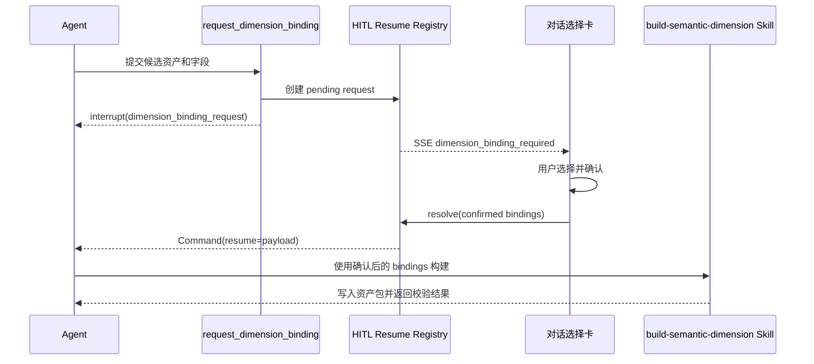

# 语义维度绑定 HITL 方案

> 状态：待审核，未开始实施  
> 长任务、Crosswalk 运行时查找与任务中心细节见：[跨源分析运行时优化与异步任务方案](2026-07-10-跨源分析运行时优化与异步任务方案.md)。
> 范围：让 Agent 在构建或刷新语义维度前，请用户在对话流中确认数据资产和字段；不改变既有外部文件权限语义。

## 问题

`build-semantic-dimension` Skill 可以构建跨源实体维度，但新维度或追加来源时，Agent 不能猜测应该使用哪张表、哪个字段。普通聊天追问会丢失候选信息、无法结构化选择，也不能在同一任务里可靠恢复执行。

用户需要在 Agent 已发现候选资产后，直接在对话历史中选择资产和字段；确认后，任务从暂停点继续执行。

## 核心决策

1. 使用 HITL，不把资产选择做成脱离任务上下文的页面表单。
2. 新增一个无副作用的 Agent 工具 `request_dimension_binding`，专门声明“需要用户选择维度输入”。
3. 复用现有外部文件权限的 LangGraph `interrupt()`、SSE、会话等待、`Command(resume=...)` 和 Trace 链路；不复用“权限授予”数据模型。
4. 选择确认前不改 `dimension.md`、Crosswalk、数据库中间表或事实表。
5. `build-semantic-dimension` Skill 只消费已确认 payload；它负责写入资产包、运行适配器、校验和汇报。

## 适用规则

| 维度创建方式 | 用户在卡片中的操作 | 确认后的动作 |
| --- | --- | --- |
| `source_field` | 选一个资产和一个字段 | 创建或替换唯一来源绑定 |
| `derived` | 选一个资产和一个字段，并确认推导规则 | 创建或替换唯一来源绑定与规则 |
| `calendar_lookup` | 选一个日期来源字段，并确认周期设置 | 创建或替换唯一日期绑定 |
| `entity_lookup` | 选一个或多个资产及键字段 | 新建、刷新或追加来源，然后重建 Crosswalk |

直接字段、推导规则和日历映射始终只有一个来源绑定；“追加来源”只适用于实体匹配。实体匹配的低置信度结果仍保留为 `candidate` / `unmatched`，不得自动进入正式分析。

## Agent 工具契约

```json
{
  "tool": "request_dimension_binding",
  "input": {
    "dimension_id": "vehicle_series",
    "operation": "create | refresh | append_binding | replace_binding",
    "resolution_mode": "entity_lookup",
    "title": "刷新车系维度",
    "reason": "需要确认销量表和配置表的车系键字段。",
    "candidates": [
      {
        "asset_ref": "table_asset:tbl_xxx",
        "display_name": "2023年1-5月乘用车市场上险量.xlsx · 工作表1",
        "kind": "table_asset",
        "fields": ["品牌", "1-子车型", "销量"],
        "suggested_fields": ["品牌", "1-子车型"]
      },
      {
        "asset_ref": "dbs_xxx.vehicle_params_wide",
        "display_name": "insight_data · vehicle_params_wide",
        "kind": "database_table",
        "fields": ["brand", "serial_name", "energy_type"],
        "suggested_fields": ["brand", "serial_name"]
      }
    ],
    "canonical": {
      "key": "entity_key",
      "fields": ["canonical_brand", "canonical_series"]
    }
  }
}
```

工具只触发中断并保存待确认请求，不读取未选资产、不执行脚本、不写语义资产。候选表和字段必须由 Agent 先通过表资产 Profile 或数据库 schema 获取。

## 中断与恢复



实现应将 DeepAgents manager 当前仅识别 `permission_request` 的逻辑泛化为可识别的 HITL request type；外部文件仍发布 `permission_required`，维度绑定发布 `dimension_binding_required`。两者共用等待与恢复能力，但前端卡片和 API 路径分别定义。

## 前端卡片

卡片放在当前 assistant 消息的任务时间线中，而不是右侧全局设置：

- 标题、操作类型、Agent 的选择理由。
- 每个候选资产显示来源、表/Sheet、字段列表与建议字段。
- 选资产后仅显示该资产的字段选择器：表格资产读取 Profile，数据库资产读取已登记表 schema。
- `entity_lookup` 可添加多个来源；其余模式固定一个来源。
- 显示将要发生的写入范围：`dimension.md`、`bindings/`、`entities.jsonl`、`references/` 或声明的 `analytics_dim_<dimension_id>`。
- 操作：`确认构建`、`取消`。取消恢复 Agent，并让其返回未执行说明。

前端不得把用户选择直接写入语义资产；只调用 resolve API 交回运行中的 Agent。

## 后端组成

1. `request_dimension_binding` 工具：参数校验、创建 pending request、调用 `interrupt()`。
2. 通用 HITL resume registry：从权限专用命名中抽出通用 request/decision 等待能力，权限 adapter 保持兼容。
3. SSE 转发：新增 `dimension_binding_required` / `dimension_binding_resolved`。
4. 会话 API：`POST /sessions/{session_id}/dimension-bindings/{request_id}/resolve` 与 cancel；校验 request 属于同一 session/query，校验选择只能来自候选项。
5. Trace：记录 `hitl.request`、`hitl.decision`、选择的资产与字段摘要；不记录敏感连接凭证。
6. Skill 更新：要求新建或刷新复杂维度时先调用此工具；只在 resume payload 已确认时执行适配器。

## 长任务执行边界

全量实体解析可能需要读取大型 Excel、拉取数据库规范键、计算匹配和写出 Crosswalk，不能通过 Agent 的交互式 `terminal` 工具同步执行。该工具有短时限，超时结果无法区分“进程已停止”和“子进程仍在写文件”，也没有可靠的进度、取消或发布状态。

确认 bindings 后，Skill 必须改为调用受控的入队和查询工具：

```text
enqueue_semantic_dimension_build(confirmed_request_id) -> { job_id, status: "queued" }
get_semantic_dimension_build_job(job_id) -> { stage, progress, logs, result, error }
```

构建 Job 由后端独立管理；状态、事件和结果摘要持久化，产物先写到 Job 关联的 staging 区。建议阶段：

1. `load_source_profiles`：确认输入资产和字段仍有效。
2. `load_source_keys`：读取所需列，不加载无关字段。
3. `resolve_entities`：生成 `auto_matched`、`candidate`、`unmatched`。
4. `validate`：计算覆盖率、冲突和与上一版本 delta。
5. `waiting_for_publish_confirmation`：完成校验并保留 staging 结果，等待用户要求发布。

Job 不自动发布。用户确认后，`build-semantic-dimension` Skill 引导 Agent 校验 staging 摘要，并只在声明维度目录内原子更新 `dimension.md` 的 reference / adapter / scope 元数据。任何失败都保留旧的活跃 Crosswalk；staging 结果可供排错，但 Agent 不得在发布前宣称刷新成功。Agent 入队后结束本轮对话；用户稍后查询时读取同一 Job 状态。

对于初次将“品牌范围”从局部 demo 扩成全量的情况，必须把 scope 改动显示在 HITL 卡片中；用户确认后才允许切换 `dimension.md` 的活跃 `reference_path`。仅生成未被维度引用的文件属于候选构建结果，不是已发布维度。

## 任务中心与消息中心

Agent 下发构建任务后应结束本轮对话，不在聊天 SSE 内等待 Job 完成。用户可稍后主动询问进度；系统也通过右上角消息中心提示完成、失败或需要审核的任务。

任务中心是统一的**展示与操作入口**，不是要求后台任务共用同一张 Job 表。语义维度构建和知识导入保持各自适合的持久化模型与 Worker；任务中心只将它们投影为统一卡片和详情视图。

```text
SemanticDimensionBuildJob
  id, session_id, query_id, dimension_id, adapter, input_snapshot
  requested_scope, status, current_step, progress
  staging_path, published_reference_path, error_message
  created_at, started_at, finished_at

SemanticDimensionBuildEvent
  job_id, level, message, metadata, created_at
```

任务中心的显示适配器为不同后台实体统一提供：

| 展示类型 | 后台实体 | 资源 |
| --- | --- | --- |
| `knowledge_import` | `KnowledgeImportJob` | 导入文件 / 知识库 |
| `table_profile` | Profile 任务记录 | 表资产 |
| `vanna_entity_import` | Vanna 导入任务记录 | 数据库表 / 实体字典 |
| `semantic_dimension_build` | `SemanticDimensionBuildJob` | 维度资产 |

每个后台 Job 保持自己的执行器和生命周期。`SemanticDimensionBuildJob` 的 Worker 复用知识导入 Worker 的设计原则：数据库 claim、独立后台循环、阶段状态、可重试、日志和失败持久化；但维度构建由自己的 adapter / subprocess runner 执行。相同 `dimension_id + input fingerprint` 的活动 Job 必须去重，防止重复全量刷新。

第一期不迁移既有 `KnowledgeImportJob`：任务中心 API 通过适配器读取各类 Job 并返回统一展示 DTO。这样不改变正在运行的导入链路，也不改变 Agent、Skill 或模型的工具契约。

Agent 不暴露任意的“创建后台任务”工具，而是使用按领域收口的 `enqueue_semantic_dimension_build`；后端创建 `SemanticDimensionBuildJob`。用户主动询问“车系维度刷新进度”时，Agent 调用 `get_semantic_dimension_build_job(job_id)`，不重新发起构建。

消息中心使用通用的 `UserNotification`，不绑定某一种任务类型：

```text
UserNotification
  id, user_id, type, severity, title, body
  resource_type, resource_id, deep_link
  read_at, created_at
```

- Job 成功：创建“车系维度已刷新”通知，深链到任务中心中的对应详情或维度详情。
- Job 失败：创建失败通知，保留失败阶段、可重试入口和日志链接。
- Job 有 `candidate` / `unmatched`：创建“需要审核”通知，深链到后续审核工作台。
- 前端提供统一任务中心，按展示类型、状态、资源筛选并支持查看事件、重试、取消；Navbar 右侧的 Bell 只展示未读通知和深链，不承担构建控制面。

## 对抗式约束

- Agent 不得提交候选列表之外的 `asset_ref` 或字段；API 必须二次验证。
- 用户确认不等于允许任意脚本写入。Skill 仅能写入声明维度目录及显式中间表目标。
- 启用“追加来源”前，后端检查既有维度为 `entity_lookup`；否则拒绝并建议替换唯一绑定。
- pending request 绑定 `session_id + query_id + tool_call_id`，不允许跨任务确认。
- 任务停止、超时或会话删除时，pending request 必须自动 reject，不能留下无限等待。
- 构建失败时保留旧的已发布 Crosswalk；新结果写临时位置并通过验证后原子替换。

## 验收标准

- [ ] Agent 针对新实体维度先展示候选资产/字段卡，不猜字段、不直接写文件。
- [ ] 用户确认后同一 SSE 任务从 interrupt 精确恢复，并执行 Skill。
- [ ] 拒绝后 Agent 继续返回取消结果，未产生语义资产变更。
- [ ] 已有 `entity_lookup` 维度可追加来源并重新生成 Crosswalk。
- [ ] 直接字段、推导规则、日历映射仅可替换唯一绑定。
- [ ] Profile/schema 不可用时卡片明确提示，不允许提交空字段。
- [ ] Trace 可看到 HITL 请求、用户决定、Skill 执行和最终构建摘要。
- [ ] 外部文件权限 approve/reject 回归不受影响。
- [ ] 大型维度构建不使用同步 terminal；30 秒以上任务通过持久化 Job 运行并可轮询。
- [ ] 失败 Job 不改变活跃 Crosswalk；只有 `publish` 成功后 Agent 才报告“已刷新”。
- [ ] Agent 入队后可正常结束本轮；用户可通过任务中心、消息中心或后续询问获取最终状态。
- [ ] 完成、失败、待审核 Job 均写入持久化通知，Navbar 显示未读提醒并支持深链。
- [ ] 任务中心可同时展示 `knowledge_import` 和 `semantic_dimension_build`，但只通过展示适配器聚合，保持既有后台任务实体与执行行为不变。
