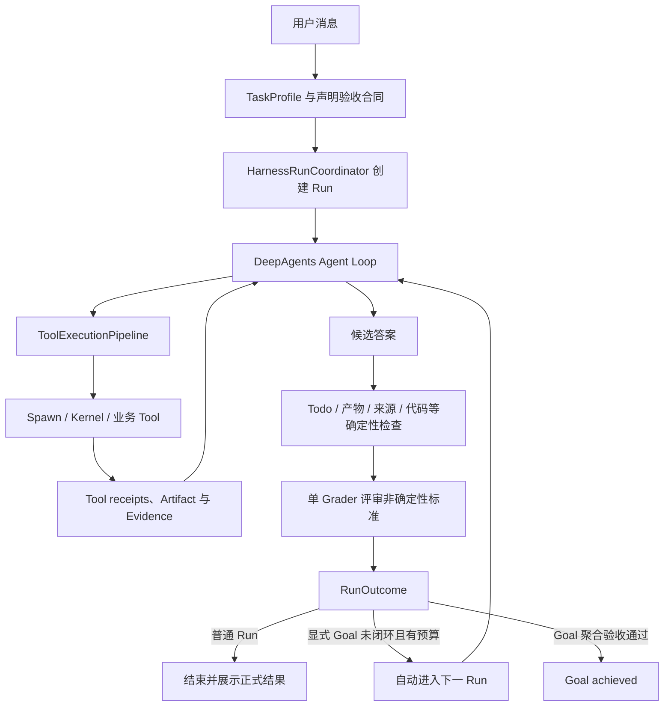

# PuddingClaw Harness Engineering 整合说明

> 文档定位：PuddingClaw Harness 的长期总入口。
> 更新时间：2026-08-11。
> 当前产品边界：先服务智能问数 Agent；通用 Agent 基座在第二个真实产品出现后再抽取。
> 权威顺序：**当前代码与 Session JSON 契约 > 本文 > 专题方案 > 历史计划/研究记录**。

本文把三类分散信息收敛到同一个位置。执行边界与权限 handoff 的最新规范以
[`docs/spawn-kernel-execution-architecture.md`](./spawn-kernel-execution-architecture.md)
为准；本文负责解释它如何嵌入 Harness 的三个控制面。

1. `Harness_Engineering_第一节课_原理与概念.ipynb` 的概念框架；
2. PuddingClaw 历史方案、复盘与实现记录；
3. 当前产品 Harness 设置页与后端实现的真实分类。

本文是 **PuddingClaw 自身的 Harness 架构与产品契约**。它回答的是：PuddingClaw 现在的 Harness 是什么、有哪些控制面、状态以谁为准、用户能配置什么、新能力应该接到哪里。外部 Agent 项目只作为局部机制的参考来源，不构成本文的结构主线，也不决定 PuddingClaw 的产品边界。

## 1. 一句话定义

Notebook 的核心公式是：

```text
Agent = Model + Harness
```

Model 负责推理和生成；Harness 是模型外部让 Agent 能够持续行动而不失控的工程系统，包括工具编排、权限与沙箱、进度、上下文、状态机、预算、验证、恢复和可观测性。

Harness 不等于：

- 一段更长的 System Prompt；
- LangGraph 本身；
- 某个 Middleware；
- 一套工具 Schema；
- Spawn/Kernel 执行 runner；
- Rubric 或 Grader 中的任意单项。

这些都是 Harness 的组成部分。Framework 是积木，Runtime 是执行引擎，Harness 是把它们组装成可持续运行产品的整车。

## 2. 三套视角如何合并

### 2.1 Notebook：八大机制

Notebook 用八大机制解释一个长任务 Agent 为什么不会像 naive loop 一样失效：

| 机制 | PuddingClaw 对应能力 |
|---|---|
| Agent Loop | DeepAgents 模型—工具循环、Run 状态与停止条件 |
| Tool Use | Toolset、ToolExecutionPipeline、结构化 Tool Result |
| Progress Tracking | HarnessTodoMiddleware、Session Todo ledger、Goal 跨 Run 进度 |
| Context Management | 全局摘要、工具结果落盘与压缩、Harness Envelope |
| Feature List | 稳定 ID Todo 的增量计划 |
| Verification Loop | deterministic checks、Rubric、Run/Goal 验收 |
| Subagents | 子上下文隔离、父 Run 权限与 Backend 继承 |
| Generator-Evaluator | 主 Agent 与单 Grader 分离；当前不引入多 Skeptic |

第二节课/历史白盒方案又补充了 Permission Gate、Hooks 与 Token Budget。PuddingClaw 已把它们分别落在权限管线、Trace/SSE 和运行保护中。

### 2.2 Notebook：三支柱

三支柱是观察维度，不是三个互斥模块：

| 支柱 | 关注的问题 | PuddingClaw 主要落点 |
|---|---|---|
| Context Engineering | 给模型什么、怎样保持长期任务连续 | Prompt/Skill/Toolset、Session 历史、摘要、Todo、Goal evidence |
| Architectural Constraints | Agent 能做什么、按什么状态迁移、如何验收 | 三个控制面、Backend、HITL、状态机、Rubric |
| Garbage Collection | 如何控制无效上下文、循环与资源膨胀 | Tool context compaction、global summary、预算、scratch/容器清理 |

### 2.3 PuddingClaw：三个控制面

PuddingClaw 的实现主轴采用三个控制面：

| 控制面 | 当前组件 | 控制对象 | 核心问题 |
|---|---|---|---|
| Action Control | `ToolExecutionPipeline` | 每次 Tool Call | 能不能做、在哪里做、是否要审批 |
| Completion Control | `CompletionVerificationCoordinator` + `GoalCoordinator` | Run 候选结果和 Goal 聚合结果 | 是否真的完成、还缺什么证据 |
| Lifecycle Control | `HarnessRunCoordinator` + `GoalCoordinator` | Run / Goal 生命周期 | 现在处于什么状态、下一步能去哪里 |

三个控制面共享 Session 中的权威状态，但互不越权：权限评审不能宣告任务完成，Grader 不能扩大工具权限，Trace 不能恢复或改写 Run。

## 3. 当前 Harness 全景



重要边界：DeepAgents 继续拥有模型—工具内循环；PuddingClaw 的三个控制面在产品外层治理动作、完成与生命周期，不重写底层 Agent Loop。

## 4. 状态权威边界

这是 PuddingClaw Harness 最重要的不变量。

| 状态/数据 | 权威来源 | 生命周期 | 不允许承担的职责 |
|---|---|---|---|
| 消息、Todo、Run、Goal、权限 grant、Artifact lease | Session 本地 JSON | 跨 Run、跨进程刷新 | 不从 Trace 反向恢复 |
| 同 Run HITL interrupt/resume | LangGraph 内存 Checkpoint | 活动 SSE Run | 不承担跨 Run 会话连续性 |
| Trace span/事件 | Trace sidecar | 审计与可观测 | 不参与 Agent 下一轮输入，不是恢复源 |
| 模型上下文 | Session 投影 + 当前 Run state + Harness Envelope | 单次模型调用 | 不能反向覆盖 Session 权威字段 |
| `/workspace` | 当前项目 Backend | 项目级 | 不能伪装为任意宿主路径 |
| `/scratch` | 当前 Run 的 Backend 临时空间 | Run 级 | 不能被登记为最终交付物 |
| 外部文件/目录原路径 | 用户授权的 Host target + lease | 按授权与 lease | scratch 副本不能冒充权威目标 |

### 4.1 Session JSON

Session JSON 是跨 Run 唯一产品状态权威，保存：

- 当前与历史 Run；
- 显式 Goal、revision、预算、跨 Run evidence；
- 稳定 ID Todo ledger；
- 权限请求与 grant；
- External Artifact、Directory、Attachment lease；
- 用户可见消息与必要的恢复元数据。

### 4.2 Checkpoint

当前 Checkpoint 是进程内 `InMemorySaver`，线程范围是活动 `session_id:query_id`。它只保证同一个活动 Run 中的 HITL 暂停与恢复；Run 终态后清理。

### 4.3 Trace

Trace 记录发生了什么，包括 model/tool/middleware/permission/verification 等 span。Trace 可以增长，因为它不进入 Agent 运行上下文；后续治理方向是分页、懒加载、归档与磁盘配额，而不是拿 Trace 替代 Session。

## 5. Lifecycle Control：Run、Goal 与 Todo

### 5.1 普通 Run

Goal 未开启时，默认尝试在一个 Run 内完成用户请求。Run 的主要状态为：

```text
preparing -> running -> waiting_hitl -> running
                     -> evaluating -> completed / verification_failed
                     -> cancelled / failed / blocked / budget_exceeded
```

`RunOutcome` 是 Run 的结构化终态原因，不是自然语言报告：

```json
{
  "run_id": "run-123",
  "status": "budget_exceeded",
  "outcome": "budget_exceeded",
  "budget_exhaustion_reason": "run_model_call_limit",
  "verification_report": {
    "status": "budget_exceeded",
    "gaps": ["本轮模型调用达到 50/50"]
  }
}
```

### 5.2 显式 Goal Mode

Goal Mode 必须由用户主动开启：

- 系统不会因为任务复杂、Run 失败或 Grader 未通过而偷偷升级为 Goal；
- Goal 默认最大 8 个 Run，可在 Harness 设置修改；
- 单 Run model-call limit 是即时熔断器，不是整个 Goal 的总预算；
- 本 Run 达到模型调用上限或修正次数后，只要 Goal 仍有 Run 预算且不是外部阻塞，就应自动开启下一 Run；
- 用户可暂停、继续、取消和修改 Goal 描述；修改会产生新 revision，旧 revision 的候选结果不能被新 Goal 接纳。

Goal 状态为：

```text
active <-> paused
active <-> blocked
active -> achieved / cancelled / budget_exceeded
```

### 5.3 HarnessTodoMiddleware

PuddingClaw 不再使用整表覆盖式 Todo，而使用 `HarnessTodoMiddleware` 暴露 `update_todos`：

- `create` 由 Harness 生成稳定 ID；
- `update/start/complete/cancel/reopen` 必须引用稳定 ID；
- `reorder` 只改变展示顺序；
- 重命名、拆分、跨 Run 续作不能悄悄删除未完成项；
- 未知旧 ID 返回结构化 Tool error，让模型按当前 ledger 对账，不中断整个 Run；
- TodoGate 只有在所有适用 Todo 已完成或明确取消时才通过。

Todo 的进度来自 Session JSON 中按 Goal revision / Run scope 管理的 ledger，不以右侧 UI 是否当前渲染为准。

## 6. Completion Control：Rubric 与闭环验收

### 6.1 Rubric 谁生成

默认不要求用户维护 Rubric。`RunRubricCompiler` 根据当前用户消息的 TaskProfile 建立声明合同；成功的 Tool action 可以单调扩展 effective contract。

例如用户要求“分析销量下降原因并输出报告”，可能形成：

```text
core
  - task_fulfillment
  - todo_reconciliation
analytics
  - metric_consistency
  - analytics_evidence_traceability
artifact
  - artifact_delivery
time_scope（用户明确提到时间范围时）
```

用户选择了分析模型，只代表可用上下文，不代表当前 Run 一定是问数任务。真正的任务类型由本轮消息与成功动作决定，避免“勾着模型做别的任务”时误套分析验收。

高级用户可以在 Harness 设置追加自定义规则，但不能关闭系统的数据正确性、安全、来源和真实产物底线。

### 6.2 Declared Contract 与 Effective Contract

- **Declared Contract**：Run 开始时根据任务意图冻结的验收标准；
- **Verification Activation**：成功的 Tool action 产生的类型化事实，例如真实执行网页检索、SQL、文件写入或测试；
- **Effective Contract**：Declared Contract 加上当前 Run 成功动作激活的 verification packs；只允许单调扩展，不因模型改口而减弱。

历史文档里的 “Effective Manifest” 是更宽的思想：最终执行必须把声明工具、实际 Tool、权限、Backend、产物和证据统一投影并对账。当前代码中验收层的具体类型名是 `RunVerificationContract` 与 effective contract，不存在一个包办所有职责的单体 `EffectiveManifest` 类。

### 6.3 Verification Packs

| Pack | 主要标准 | 验证方式 |
|---|---|---|
| `core` | 任务完成度、Todo 收口 | LLM Grader + deterministic |
| `web_research` | 网页来源可追溯 | deterministic |
| `analytics` | 指标口径一致、分析证据可追溯 | Grader + deterministic |
| `artifact` | 目标产物真实存在且可定位 | deterministic |
| `code` | 存在与修改相称的测试/构建/静态检查 | deterministic |

时间范围和报告完整性等任务规则由 compiler 按消息补充。未来新增 Pack 必须同时定义激活条件、证据结构、验证器和前端中文展示，不能只加一段 Prompt。

### 6.4 验收顺序

```text
候选结果
  -> Todo reconciliation
  -> Artifact / Web / Analytics / Code deterministic checks
  -> 单 Grader 处理 task_fulfillment、metric_consistency 等语义标准
  -> 合并逐项结果
  -> continue / complete / verification_failed / infrastructure_error
```

确定性检查必须基于结构化 state、Tool receipt 和 artifact/evidence，不接受“模型说已完成”作为证据。Grader 是评审器，不等于只有一个总分；当前输出是逐 criterion 的通过、依据、缺口和总体解释。

### 6.5 Run 验收与 Goal 聚合验收

- Run 验收回答“这一轮产生了什么、这一轮的证据是否充分”；
- Goal 聚合验收回答“当前 Goal revision 是否已经被一个或多个 Run 的可信证据共同满足”；
- Goal evidence 带 origin Run 与 revision；
- Grader 未通过时，候选回答不能在 UI 冒充正式完成；
- 验收基础设施异常与业务任务未通过必须分开显示，不能把 `grader_error` 当作业务失败。

## 7. Action Control：工具、权限与 Backend

### 7.1 ToolExecutionPipeline

每个 Agent Tool Call 必须经过统一管线：

```text
Tool visibility / Toolset
  -> Tool control descriptor
  -> 参数与 shell 能力分析
  -> hard deny
  -> deterministic allow / ask
  -> 智能灰区 reviewer（仅 smart 且符合条件）
  -> HITL / grant
  -> Backend 或业务 Tool 执行
  -> receipt / evidence / trace
```

核心规则是 `deny > ask > allow`。未知 Tool、未注册 Toolset 或缺少 control descriptor 时 fail-closed，并给开发者可定位错误。

### 7.2 严格审批与智能审批

审批模式在对话输入区选择，不藏在设置深处：

- **严格审批**：所有需要授权的动作由用户确认；
- **智能审批**：边界内低风险工作默认进行，越界、不可逆或外部副作用才打断。

智能模式采用“边界优先 + 确定性快路径 + 灰区 reviewer”的组合策略。外部 Agent 的对比研究只用于验证这种策略的可行性，最终规则由 PuddingClaw 的 Backend、Session grant 和产品风险边界决定：

| 类别 | 智能模式 |
|---|---|
| Spawn 宿主或 Kernel profile 内普通 Python、Node、本地计算、写文件、构建、测试、格式化 | 自动放行 |
| 公共安全 URL 的只读 fetch/search | 自动放行 |
| 安全本地 Git（add/commit/stash/switch 等，不覆盖修改） | 自动放行并记录 |
| `install_packages`、受管 runtime 变更与临时联网 | 按 desired-set/effect plan 进行 package/network HITL，可复用同 scope Grant；不生成 `pip *` 等宽泛授权 |
| raw network、未知域名、下载后执行 | HITL |
| 外部文件/目录写回、外部业务副作用 | HITL + receipt/plan |
| 递归删除、危险 Git、权限/所有权修改 | HITL 或拒绝 |
| sudo、Docker control、Kernel 越界、跨 lease、Harness 内部目录 | hard deny |

`python3`、`node`、`bash` 不是天然安全或危险。分类必须结合 Backend、cwd、读写路径、网络、安装包、删除/覆盖、外部副作用和已有 grant。Shell script 必须读取实际脚本内容再分类，不能按解释器名称无脑放行。

当前灰区 reviewer 仍是 `ToolExecutionPipeline` 内面向少量本地 Shell 场景的降噪器，不等同于完整的语义授权层。后续计划将“Toolset 管能力可见性”与“Auto Middleware 管具体动作授权”明确拆分，并在主模型提出一批 `tool_calls` 后生成可 checkpoint 的逐调用授权计划；该计划目前是非阻塞待办，不改变现有 Smart、Spawn 或 Kernel 验收结论。详见 [Smart 动作授权中间件待办方案](./plans/2026-08-15-smart-action-authorization-middleware-todo.md)。

### 7.3 Session Grant 与 Subagent

权限 grant 按语义 capability、scope、Backend、workspace、policy epoch/version 去重，不按 command string 或 tool_call_id 重复弹窗。

Subagent 继承父 Run 冻结的 `EffectivePermissionContext`：

- 能力只能相同或更小；
- 父 Run 已授权 workspace/project/lease 内的同类动作不重复询问；
- 新域名、新外部目录、package/network 或新副作用必须重新申请；
- reviewer 不能扩大 sandbox hard boundary。

### 7.4 Spawn / Kernel 执行边界

PuddingClaw 产品只保留两种执行模式：

| 模式 | Harness 语义 | OS 语义 |
|---|---|---|
| `spawn` | 正式实现 `SandboxBackendProtocol`，所以 DeepAgents `execute` 始终可见；低风险宿主探索不逐次弹窗 | 直接创建宿主进程；Tool Gate、`root_dir` 和目录 Grant 不是 OS 隔离 |
| `kernel` | 与 Spawn 共用 Tool Gate、runtime resolver、receipt 和审计；只改变最后的 runner | macOS 使用 Seatbelt；Linux 和 Windows via WSL2 使用 bwrap + namespaces + seccomp + `no_new_privs`；probe 失败必须显式 fallback |

两种模式都必须经过同一条 handoff：

```text
ToolExecutionPipeline
  -> effect / capability decision
  -> SandboxGrantProfile
  -> one-shot ExecutionPermit
  -> AuthorizedExecution
  -> SpawnRunner or KernelRunner
```

`ExecutionPermit` 绑定 command/profile/permission revision/runner binding，只能消费一次；Secret 作为临时环境注入，不能拼入命令、Session、Trace 或模型上下文。Kernel fallback 也分作用域：稳定的平台/部署不可用可把项目持久化切到 `spawn`，一次性故障才使用 Run-only fallback；任何 fallback 都必须经过服务端 HITL，不能静默降级。

Docker 只保留为显式、typed 的 managed runtime 兼容能力，例如尚未迁移的 Provider CLI 或浏览器授权 CLI。它不是普通 Skill 的默认 runner，不是 Kernel 失败后的自动退路，也不应继续出现在产品级执行模式选择里。迁移完成后删除对应 Docker 兼容面，不删除 DeepAgents `execute`。

### 7.5 精确文件、外部目录与附件

#### 精确外部文件

```text
read_resource(host exact file)
  -> stage_external_artifact
  -> /scratch/external/<lease_id>/...
  -> inspect_file_version + patch_file / write_file / execute
  -> validate
  -> commit_external_artifact(expected source hash)
```

精确文件授权不会自动扩大到父目录。读完后若发现真实 sibling dependency，Agent 才调用 `stage_external_directory` 请求目录授权。

#### 外部目录

```text
stage_external_directory
  -> /scratch/external-directories/<lease_id>/...
  -> 目录内修改、运行、联调
  -> prepare_external_directory_commit
  -> 用户审阅 diff/plan
  -> commit_external_directory
```

修改、运行、联调整个目录时，产品优先建议用户把它作为项目打开；用户坚持在当前会话继续时，允许走显式目录 lease，不把“建议”变成硬拒绝。

#### 上传附件

- 只读分析：`read_resource`；
- 修改附件：`prepare_attachment_edit` -> `/scratch` -> `publish_attachment`；
- 上传/粘贴/给路径的文件不会一律复制成新的权威附件；只有编辑链路需要受控暂存，原目标身份必须保留。

### 7.6 文件编辑协议

`edit_file(old_string, new_string)` 已从模型主路径淘汰，因为字符串漂移会造成反复 `String not found`。新路径是：

```text
inspect_file_version -> expected_sha256 -> patch_file(replacements[]) -> receipt
```

Hash 或 hunk 不匹配时必须重新 inspect/rebase，不能连续猜字符串；batch patch 任一冲突不写入半成品。

## 8. Toolset 与 Skill 组织

Toolset 是稳定的平台能力分类；Skill 是发现和激活业务流程的入口；Tool 是受 Harness 控制的执行原语。三者不能混为一层。

### 8.1 默认 Toolset

当前注册表的默认能力包括：

| Toolset | Tools |
|---|---|
| `core_workspace` | `ls`, `read_file`, `glob`, `grep`, `update_todos` |
| `workspace_write` | `write_file` |
| `local_execution` | `execute` |
| `delegation` | `task` |
| `harness_files` | versioned patch、外部 artifact/directory、attachment edit/publish 工具 |
| `web_research` | `web_search`, `fetch_url` |
| `package_management` | `install_packages` |

`read_resource` 也是默认自定义工具，但保持独立的外部资源权限语义。

### 8.2 按 Skill 激活的业务 Toolset

当前包括：

- `skill_management`；
- `knowledge_analysis`；
- `database_analysis`；
- `semantic_lookup`；
- `semantic_dimension_build`；
- `logical_dataset`。

`SkillIntentRouterMiddleware` 只推荐应读取哪个 Skill，不直接放工具；`ToolsetMiddleware` 根据真正读取成功的 `SKILL.md` 推导可见与可执行工具。一个 Skill 可以声明多个 Toolset，多个 Skill 也能复用同一 Toolset。

### 8.3 Skill Management

Skill 管理已经收敛为 `skill-management` Skill：

- `inspect_skill`；
- `prepare_skill_install` / `install_skill`；
- `prepare_skill_update` / `update_skill`。

预检产生不可变 plan、digest 和 diff；提交与 exact plan 绑定并原子写入 `/skills`。普通 `execute`、`write_file`、旧 `edit_file` 不能绕过受管安装流程。

### 8.4 Tool Guide 渐进注入与登记流程

Tool Guide 分为两层：

- `backend/prompts/SOUL.md`、`IDENTITY.md`、`AGENTS.md` 按固定顺序组成系统 Stable Core 的主体；bundled `USER.md` 已移除，用户事实进入 Memory，用户追加规则只使用 Home `profile/AGENTS.md`。
- `backend/prompts/tool_guides/core.md` 是常驻协议，由 `deepagents_prompt_builder.py` 固定装入每个 Agent Run；只有所有 Run 都需要遵守的通用工具、资源、验收和引用规则才放这里。
- 同目录下的其他 Guide 是按请求披露的能力协议，必须登记到 `manifest.yaml`，由 `ToolGuideMiddleware` 在每次模型调用前按实际能力集合注入。

新增 Tool 后，如果模型仅靠 Tool schema 就能正确使用，不必创建 Guide。需要额外流程、优先级、禁止行为或跨工具编排规则时，按以下步骤登记：

1. 先把 Tool 注册到对应 Toolset，并完成 `ToolControlDescriptor`、权限和 Harness 约束。
2. 复用已有协议时，把工具名或前缀加入现有 manifest 条目；需要独立协议时，新建 `tool_guides/<guide-id>.md`。
3. 在 `tool_guides/manifest.yaml` 中登记唯一 `id`、`file` 和至少一种激活条件。
4. 增加“命中时注入、未命中时不注入”的 Middleware 测试；工具由 Skill 门控时，还要覆盖 Skill 成功读取后的下一次模型调用。
5. 重建 Agent 或重载后端。Middleware 在构造时冻结 Guide 内容及 SHA256，修改磁盘文件不会改变已经构造的实例。

Manifest 支持四种激活条件，任一命中即可激活：

```yaml
- id: browser-automation
  file: browser-automation.md
  skills:
    - browser-automation
  skill_prefixes:
    - browser-
  tools:
    - browser_open
    - browser_click
  tool_prefixes:
    - browser_
```

运行时顺序固定为：

```text
成功读取 SKILL.md
  -> ToolsetMiddleware 更新 active_skill_ids 并过滤 request.tools
  -> ToolGuideMiddleware 用 active_skill_ids 和过滤后的工具名匹配 manifest
  -> 将命中的 Guide 追加到本次 system message
  -> 发出 tool_guides_activated 事件和 Trace（guide id、原因、内容 hash）
```

触发边界：

- `tools` / `tool_prefixes` 匹配的是本轮模型**可见的工具**，不是已经调用的工具。
- 始终可见的默认工具一旦登记，会使对应 Guide 近似常驻。短小且普遍适用的规则应放 `core.md`；复杂规则应优先通过 Skill/Toolset 门控后再披露。
- 当前没有“首次调用某工具后才激活”的条件。确需该语义时应新增结构化 `called_tools` 激活维度，不能把“可见”误写成“已调用”。
- Skill 和 Tool 条件可以同时登记，它们是 OR 关系；Tool 条件可作为能力已经可见时的确定性兜底。
- 新增未登记的 Guide Markdown 会触发孤儿文件校验并阻止错误配置启动；只新增 Tool 而不提供 Guide 是允许的。

## 9. Context Engineering 与协议完整性

当前 Agent Prompt 的来源、最终顺序以及新增 Prompt/Guide/Skill 的选择规则，统一见
[PuddingClaw Harness Prompt 标准规范](./puddingclaw-harness-prompt-guide.md)。该文档只描述当前 Agent/DeepAgents 模式，不再把已废弃 Chat Prompt 混入 Harness 规范。

### 9.1 全局摘要

DeepAgents 全局摘要阈值可在 Harness 设置中配置。触发时：

- 摘要历史叙述与旧上下文；
- 保留最近必要消息；
- 后端从 Session JSON 重新追加权威 `<HARNESS_ENVELOPE>`；
- Envelope 至少携带 Goal revision、Todo、Artifact/Evidence、验收缺口和有效权限；
- 模型生成的伪 Envelope 会先被剥离，不能冒充权威状态。

### 9.2 Tool Context Compaction

- 超大单条 Tool Result 先无损落盘到 `/large_tool_results/`，模型只拿预览与精确读取路径；
- 当前 Run 默认优先保留完整证据；执行中即时压缩是可选项；
- Agent 结束后后台压缩较旧 Tool Result；
- 默认保留最近 12 条完整结果，阈值均可配置；
- `tool_call_id`、result identity、raw output ref 和 Harness evidence 必须保留。

### 9.3 ToolProtocolIntegrityMiddleware

OpenAI 兼容协议要求带 `tool_calls` 的 assistant message 后必须有每个 `tool_call_id` 对应的 ToolMessage。压缩、取消、HITL 或 Provider 兼容问题都不能破坏这组配对。

`ToolProtocolIntegrityMiddleware` 在送模前规范化 ID、识别缺失/孤儿/重复 pair，并为真正待执行的调用保留完整协议。上下文压缩只能在协议边界上切分，不能留下半个 Tool 交换。

## 10. 当前 Harness 设置分类

设置页不是架构的唯一真相，但它是面向用户的稳定信息架构。当前五类如下：

### 10.1 SubAgent

- 子代理启停、名称、模型、描述和 System Prompt；
- tools/skills 继承或收缩；
- 运行时必须继承父 Run Backend 与 permission context，不能独立扩大权限。

### 10.2 上下文工程

- DeepAgents 全局摘要触发阈值；
- Tool Context Compaction 开关；
- 执行中单条即时压缩；
- 后台压缩单条下限；
- 保留最近完整 Tool Result 数量。

### 10.3 Goal 与验收

- Run Rubric 开关；
- 单 Run 最大修正轮数；
- 是否允许用户显式开启 Goal Mode；
- 单 Goal 最大 Run 数；
- 高级自定义 Rubric 规则。

### 10.4 终端与沙箱

- `execution_mode=spawn|kernel`，默认 `spawn`；
- Kernel runner probe、平台能力和失败原因；
- 项目级稳定 fallback 与 Run-only 临时 fallback；
- Kernel profile 的 workspace/scratch、external read/write/deny roots、网络和资源上限；
- `install_packages` 的 desired-set、runtime binding 和安装事务；
- 显式 managed Docker runtime 的独立状态，不混入普通执行模式。

### 10.5 运行保护

- `ModelCallLimitMiddleware` 开关；
- 单 Run 调用上限；
- Session/thread 累计上限；
- 达限后优雅结束或抛错。

严格/智能审批属于当前 Session 的交互策略，在聊天输入区选择；它不是全局 Harness Settings 中的静态值。

## 11. 前端产品契约

前端必须适配 Harness 后端状态，不能只显示最终文本：

- 输入区：项目、审批模式、思考开关；模型/附件/Skill/Goal 放在 `+` 菜单；
- Goal：显式开启、暂停、继续、修改、取消、Run timeline、预算；
- Progress：展示 Session 权威 Todo ledger；
- Activity：运行中的瞬时阶段不写进回答正文，也不占用顶部导航；在输入框上方以流式状态条展示“子代理处理中、正在查询、正在写入、正在验收、正在修正验收缺口、等待授权、正在进入下一轮”等关键事件；
- Progress 面板保留 Todo 任务台账，并同步展示当前 Activity，避免把工具明细或模型过程文本误当任务进度；
- Permissions：按 grant 聚合，展示中文动作、风险、scope、来源与有效期；
- Verification：逐项中文 criterion、规则、判定依据、缺口、模型说明；
- Completion：区分执行中、候选完成、确定性检查、模型验收、修正中、正式接纳；
- Candidate publication：Goal 执行中的过程说明及 `pending / progress / failed / unverified` 候选均只保留在 Session/Trace，不进入聊天正文；修正结果使用新 segment；accepted candidate 也要等流正常结束、运行态同步收口后才作为正式答案一次性发布，确保用户看到答案时任务已经完成；
- Verification UX：验收开始、未通过和自动修正不弹聊天卡片，也不强制打开验收抽屉；底部运行状态保持“正在验收/正在修正”，验收明细仍可由用户主动在 Harness 抽屉查看；
- History rendering：前端只能暂缓当前活跃 Run 的未验收输出；Run 结束、停止或中断后必须按持久化的普通消息恢复历史，不得依据 `verification_state` 永久过滤，也不得增加“候选/失败候选”产品包装；
- Context：全局压缩要持续显示，不能一闪而过；token meter 必须按当前 Session/Run 请求防止旧请求回写；
- Trace：用于审计和排障，不承担会话恢复。

## 12. PuddingClaw 决策与参考来源

本节只用于溯源，不表示 PuddingClaw 从属于某个外部框架。表中首先列出 PuddingClaw 自身已冻结的产品决策，再记录少量外部启发。

| 机制 | 来源 | PuddingClaw 取舍 |
|---|---|---|
| 三控制面、Session 权威边界、Goal aggregate evidence | PuddingClaw | 产品化协调层 |
| Spawn/Kernel runner、ExternalArtifact/Directory/Attachment lease | PuddingClaw | 保留精确目标身份与可审计写回；OS 边界只由 Kernel 提供 |
| TaskProfile、Effective Contract、deterministic checks、RunOutcome | PuddingClaw | 形成任务分类、真实证据与完成状态的闭环 |
| HarnessTodoMiddleware、Harness Envelope、ToolProtocolIntegrity | PuddingClaw | 保证跨 Run 进度、压缩和工具协议完整性 |
| Agent = Model + Harness、八大机制、三支柱 | Harness Engineering Notebook | 仅作为教学与审视坐标，不按章节直接复制实现 |
| LangGraph checkpoint / interrupt、DeepAgents loop/middleware | LangChain / DeepAgents | 复用 Runtime，不让它替代产品状态机 |
| boundary-first、Reviewer 不扩大 sandbox | Codex 参考 | 用于校验智能审批降噪原则 |
| deterministic fast-path、危险模式 | Grok Build 的局部参考 | 只用于校验少量权限分类思路，策略、状态与实现均由 PuddingClaw 重写 |
| Toolset 渐进暴露 | Hermes 分类启发 + PuddingClaw | Skill 推荐与 Tool 执行硬边界分离 |
| 多轴业务 Tool descriptor / idempotency | StaffDeck 启发 | 当前先落 descriptor；通用外部副作用 executor 后续补 |
| provider/provisioner、file/skills namespace | Yuxi 启发 | 远程/K8s 阶段再引入，不改变 Spawn/Kernel 的本地权限边界 |

需要特别强调：**PuddingClaw 大部分 Harness 内容与 Grok Build 没有直接来源关系**。三控制面、Session 权威边界、Goal/Run 状态机、TaskProfile、Effective Contract、Rubric 闭环、Spawn/Kernel Backend、外部文件/目录/附件 lease、HarnessTodoMiddleware、Harness Envelope、Toolset、上下文压缩、协议完整性和前端设置，均应按 PuddingClaw 自身需求、现有技术栈和长期复盘来理解。Grok Build 只提供了权限确定性快路径、TodoGate 等少量局部参考，不是总体架构母版。

PuddingClaw 明确不采用的外部做法：

- Grok Build 多 Skeptic panel；
- 模型自报完成作为终态；
- 每 Run 创建一个容器；
- Trace 作为恢复源；
- 语义资产未命中就一律 fail-closed；有明确资产时严格执行，没有时允许模型泛化并透明说明；
- 给所有 Python/Node/bash 的粗粒度白名单；
- 为了方便联调隐式扩大精确文件到父目录。

## 13. 新能力接入检查表

新增 Tool、Skill、状态或前端能力时至少回答：

1. 属于 Action、Completion 还是 Lifecycle Control？
2. 状态权威存在哪里，跨 Run 是否需要 Session JSON？
3. 是否注册 Toolset 和 `ToolControlDescriptor`？
4. 是否需要额外 Tool Guide；若需要，已登记哪些 Skill/Tool 激活条件？
5. smart/strict 下分别 allow、ask 还是 deny？
6. 是否扩大 Backend、workspace、lease、network 或外部副作用？
7. 成功后产生什么 receipt、Artifact 或 Evidence？
8. 会激活哪个 verification pack？
9. deterministic verifier 是否真实存在？
10. Global Summary、Tool Context Compaction 是否保留其权威信息？
11. HITL 恢复时 tool-call protocol 是否完整？
12. Subagent 能否继承，能力是否只能收缩？
13. UI 如何展示运行、审批、缺口和正式完成？

## 14. 测试门禁

### Action Control

- 未注册 Tool/descriptor fail-closed；
- strict/smart 策略矩阵；
- Spawn 与 Kernel 使用一致的 effect/approval 分类，Kernel 额外验证 OS profile；
- `ExecutionPermit` 单次消费、runner binding 和 profile revision 失效；
- network/package/destructive/external side effect；
- Session grant 去重与 policy epoch 失效；
- subagent 不重复 workspace 授权；
- 外部 file/directory/attachment lease 和并发 source hash 冲突。

### Completion Control

- TaskProfile 不因“选中分析模型”误分类；
- Tool activation 单调扩展 effective contract；
- Todo、Artifact、Web、Analytics、Code deterministic gate；
- Grader 缺项、重复项、契约外 criterion、异常与预算；
- 候选答案不冒充 accepted answer；
- Goal aggregate evidence 绑定 origin Run 与 revision。

### Lifecycle Control

- Session 只允许一个非终态 Run/active Goal；
- 合法/非法状态迁移；
- Run model-call 达限但 Goal 有预算时自动续 Run；
- Goal pause/resume/cancel/update revision；
- 重启与刷新后 Session JSON 恢复，Trace 不参与；
- terminal Checkpoint 清理。

### Context 与 UI

- `tool_calls` / ToolMessage 配对；
- 摘要后 Harness Envelope 对账；
- 大 Tool Result 无损落盘与精确回读；
- Todo/Goal/Token meter 刷新不被旧请求覆盖；
- 验收、权限、错误信息中文化且位置正确。
- 顶部导航不承载运行状态；输入框上方状态条与右侧 Progress 共享同一套 Run Activity 语义。

## 15. 历史文档索引

本文已经吸收这些文档中的长期 Harness 决策。它们继续保留设计过程、旧基线和详细测试记录，但不应被当作当前唯一入口。

| 文档 | 被本文吸收的内容 | 当前角色 |
|---|---|---|
| [权限机制与执行边界整体方案](./权限机制与执行边界整体方案.md) | PermissionRequest/Grant、外部文件、Terminal、HITL、Trace | 权限专题历史方案 |
| [Tool Context 压缩设计](./tool-context-compaction-design.md) | tool_call_id、raw output、后台压缩、阈值、UI、测试 | 上下文专题设计 |
| [上下文工程设计](./context-engineering-design.md) | 旧 Chat Middleware 栈、摘要/裁剪/工具清理、持久化与 Token UI | Context Engineering 历史基线；Agent 以 DeepAgents 当前实现为准 |
| [Harness 白盒化 Trace 方案](./plans/2026-06-29-harness-whitebox-trace-plan.md) | 八大机制 × 三支柱、Trace span、机制映射 | Trace 信息架构来源 |
| [Trace + Todos 方案](./plans/2026-06-26-trace-and-todos-whitebox-plan.md) | Todo/Trace 持久化演进、Checkpoint 边界 | 历史实现计划 |
| [State 与 Model Input 双事实 Trace](./plans/2026-07-02-state-first-trace-plan.md) | State snapshot/diff、模型输入、归因和 UI | Trace 事实边界专题 |
| [Middleware Hook Invocation UI](./plans/2026-06-30-middleware-hook-invocation-ui-plan.md) | Hook 次数、流程视图、事件与 diff | Harness 白盒 UI 专题 |
| [Partial Run Session Persistence](./plans/2026-07-09-partial-run-session-persistence-plan.md) | 中断结果与 Session 写入 | 恢复专题计划 |
| [Agent/Chat 运行时拆分](./plans/2026-06-25-agent-chat-runtime-split.md) | DeepAgents、Backend、Session、Context、Checkpoint、Docker 演进 | Runtime 迁移历史 |
| [Harness SubAgent Settings](./plans/2026-07-01-harness-subagent-settings-plan.md) | Subagent 设置与前端 | 设置专题记录 |
| [Skill 与 Toolset 渐进加载](./plans/2026-07-12-skill-tool-bundles-plan.md) | Skill/Toolset/Tool 三层、动态可见性 | Toolset 权威设计 |
| [受管 Skill 安装与更新](./plans/2026-07-18-managed-skill-install-update.md) | Skill prepare/commit、权限与原子更新 | Skill 管理专题 |
| [ModelClient × DeepAgents 测试清单](./plans/2026-06-24-model-client-deepagents-test-checklist.md) | Tool calling、stream、summary、subagent、HITL/permissions 测试 | 集成测试历史 |
| [ModelClient × DeepAgents 测试记录](./plans/2026-06-25-model-client-deepagents-latest-test-run.md) | DeepAgents 真实兼容验证 | 测试记录 |
| [Notebook 集成说明](./notebook-modelclient-deepagents-integration.md) | Notebook 与 ModelClient/DeepAgents 运行环境 | 教学集成说明 |
| [项目级 AGENTS.md 记忆](./deepagents-project-memory.md) | 项目 Context、MemoryMiddleware 与路径边界 | 项目记忆专题 |
| [后端架构讲解文档](./backend架构讲解文档.md) | 旧 Middleware、Session、Tool、Skill、API 架构 | 旧架构背景，需以当前代码校正 |
| [项目架构文档](./PROJECT_ARCHITECTURE.md) | Session、工具、压缩、Skill、安全基础 | 早期总览，非 Harness 权威入口 |
| [Agent 引用来源面板](./agent引用来源面板技术方案与开发计划.md) | 来源 receipt、SSE、引用绑定与前端证据展示 | Web/Analytics evidence 的产品来源 |
| [UI Segment 渲染顺序](./ui-segment-rendering.md) | 流式内容、工具块与错误段落顺序 | Harness 运行反馈的渲染约定 |
| [UI 工作台路线](./puddingclaw-ui-workspace-roadmap.md) | 项目工作区、本地文件、安全和 Agent 面板 | Workspace 产品演进背景 |
| [知识库与结构化数据统一架构](./知识库与结构化数据统一架构方案.md) | 问数 Tool 路由、数据/语义资产、附件 | 垂直业务域输入 |
| [ADR-003](./adr/ADR-003-vpn-fake-ip-https-compatibility.md) | 安全联网与 Skill/fetch 的 Fake-IP 兼容 | 网络安全专题 |
| [早期外部 Agent Harness 对比研究](./grok-build-to-puddingclaw-harness-architecture.md) | Grok/Codex/StaffDeck/Yuxi 的局部机制扫描及后续演进记录 | 历史文件名沿用；附属参考，不代表 PuddingClaw Harness 源自 Grok |
| [DeerFlow 2.0 Harness 对比与借鉴分析](./deerflow-harness-对比与借鉴分析.md) | DeerFlow 2.0（独立 harness 包形态）逐维度对比、十条借鉴清单与明确不借鉴项 | 外部参考；借鉴与否以 PuddingClaw 产品边界为准 |

## 16. 代码入口

| 领域 | 主要代码 |
|---|---|
| 状态模型 | `backend/harness/models.py` |
| Run/Goal 协调 | `backend/harness/coordinators.py` |
| Rubric 编译 | `backend/harness/rubric_compiler.py` |
| 确定性检查 | `backend/harness/deterministic_checks.py` |
| TaskProfile | `backend/harness/task_profiles.py` |
| Tool activation/evidence | `backend/harness/verification_activations.py` |
| Tool 权限管线 | `backend/harness/tool_execution.py` |
| 灰区 reviewer | `backend/harness/permission_reviewer.py` |
| Toolset/descriptor | `backend/tools/toolsets.py` |
| Tool Guide 常驻/按需注入 | `backend/prompts/tool_guides/`、`backend/graph/middlewares/tool_guides.py` |
| Agent Prompt 标准规范 | [PuddingClaw Harness Prompt 标准规范](./puddingclaw-harness-prompt-guide.md) |
| Todo | `backend/graph/middlewares/harness_todos.py` |
| Tool protocol | `backend/graph/middlewares/tool_protocol.py` |
| DeepAgents 装配/summary/checkpoint | `backend/graph/deepagents_manager.py` |
| AgentState 长期参考 | [AgentState Schema Living Reference](./agent-state-schema.md)：主 Agent 39 键联合 schema、渐进状态、Runtime/Session/Model Input 边界与定期复盘清单 |
| Session 权威存储 | `backend/graph/session_manager.py` |
| Harness 设置 UI | `frontend/src/app/settings/page.tsx` |
| Goal/验收/权限面板 | `frontend/src/components/citations/SourcesPanel.tsx` |
| 审批模式输入 UI | `frontend/src/components/chat/ChatInput.tsx` |

以后若本文与代码不一致，应先确认这是实现回归还是产品决策变化；修复后同步更新本文和对应专题文档，避免再次让重要边界散落在聊天记录中。
