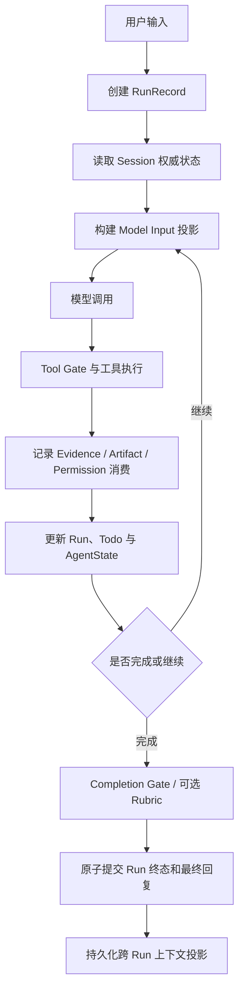

# PuddingClaw Session 与上下文架构

> 文档性质：面向框架使用者、集成者和维护者的发布级架构说明。
> 适用范围：PuddingClaw Agent / DeepAgents 运行时。旧 Chat 运行时不属于目标架构。
> 最后复盘：2026-08-06。
> 权威顺序：运行时代码与持久化 Schema > 本文 > 历史方案或聊天记录。

## 1. 一句话理解 Session

PuddingClaw 的 Session 不是“发给模型的聊天记录”，而是一个跨 Run 持久化的控制面状态容器：它保存对话事实、Goal、Run、Todo、权限、Skill 激活、Evidence 和 Artifact；模型每一轮看到的上下文只是从这些事实中构建出来的有界投影。

最重要的区分是：

```text
Session 持久化事实 != LangGraph 当前 Run 状态 != Model Input != Trace
```

- **Session JSON**：跨 Run 的产品状态和控制面事实。
- **LangGraph Checkpoint / AgentState**：同一 Run 内模型—工具循环的工作状态。
- **Model Input**：某次模型调用实际收到的 System、Tools 和 Messages 投影。
- **Trace**：解释一次执行发生了什么的观测记录，不授予权限，也不反向成为业务事实。
- **Workspace / Database**：文件、知识、分析结果等大体量业务资产的最终存储；Session 通常只保留身份、摘要和引用。

## 2. 为什么不能只保存 messages

纯聊天应用可以把历史消息当作唯一状态，但可执行 Agent 不能这样做。旧消息会被裁剪、摘要或移出模型窗口，而以下事实不能因此丢失：

- 用户当前的 Goal 及其 revision；
- 哪个 Run 正在执行、等待授权或已经结束；
- 哪些 Todo 已完成、哪些仍待处理；
- 哪个 Skill 已通过权威 `SKILL.md` 激活；
- 用户授予了什么权限、权限是否已消费或撤销；
- 哪个工具结果构成可复用 Evidence；
- 哪个文件是正式交付 Artifact，它当前对应什么内容哈希；
- 验收失败的具体缺口以及是否已经修复。

因此 PuddingClaw 把“对话叙述”和“执行事实”分开保存。摘要可以改变模型如何阅读历史，但不能改变控制面事实。

## 3. 五类数据语义

理解 `session.json` 时，先判断字段属于哪一类，而不是先看它位于哪个 JSON 层级。

| 类型 | 定义 | 例子 | 能否被摘要覆盖 |
|---|---|---|---:|
| 权威状态 Authority | 当前产品行为必须以它为准 | Goal、Run、Todo ledger、Permission grant、Evidence record、Delivered Artifact | 否 |
| 不可变记录 Ledger/Receipt | 证明某件事何时、由谁、基于什么内容发生 | Validation receipt、mutation receipt、delivery receipt | 否 |
| 模型投影 Projection | 从权威状态和历史构造，供模型继续执行 | `session_summary_projection`、`run_agent_context`、Capability/Permission Manifest | 可以重建 |
| 缓存 Cache | 减少重复读取或计算，不独立授予能力 | `skill_cache`、已压缩 Tool Result | 可以失效和重建 |
| 观测与 UI 投影 Observability | 用于解释执行或显示界面 | Trace 引用、Graph、token usage、`todos` 顶层镜像 | 可以重建或丢弃 |

“单独的权威状态”首先是逻辑所有权，不要求每一类立即拆成单独文件。当前实现以 Session JSON 作为原子状态快照；未来可以在保持相同所有权契约的前提下迁移到数据库或追加式 Ledger。

## 4. 一次 Agent Run 的状态流



这里存在两条并行的“历史”：

1. transcript 保存用户可见的对话和工具调用；
2. control plane 保存可执行、可校验的结构化事实。

下一次 Run 可以从 transcript 读取语义背景，但必须从 control plane 恢复权限、Goal、Todo、Evidence 和 Artifact 身份。

## 5. 当前 Session 顶层结构

下表描述当前 Agent 路径可能出现的主要字段。字段按职责解释，不代表每个 Session 都会同时包含全部字段。

| 字段 | 类型 | 职责 | 权威性 | 压缩行为 |
|---|---|---|---|---|
| `title/created_at/updated_at` | metadata | Session 基础信息 | 权威 | 保留 |
| `runtime_mode/project_id/workspace_path/...` | metadata | 运行时和项目绑定 | 权威 | 保留 |
| `messages` | transcript | 当前持久化消息、附件和 Tool Call | 对话事实 | 原文保留，模型可只看投影 |
| `permissions` | control | approval mode、policy epoch、Grant 及 revision | 权威 | 保留 |
| `harness` | control | Goal、Run、顺序索引、完成请求和验收状态 | 权威 | 保留 |
| `todo_ledgers` | control | 按 Run 或 Goal revision 分区的 Todo | 权威 | 保留 |
| `todo_ledger_meta` | control | Todo ledger 的 revision 和范围元数据 | 权威 | 保留 |
| `todos` | UI projection | 当前 Todo 的兼容/显示镜像 | 非权威 | 可重建 |
| `evidence_index` | control index | Evidence 身份的快速索引 | 权威索引 | 保留 |
| `evidence_ledger` | ledger | 带来源 Run、Tool Call、摘要哈希和继承规则的 Evidence | 权威 | 保留 |
| `delivered_artifacts` | control registry | 正式交付路径当前对应的内容哈希和 receipt | 权威 | 保留 |
| `skill_cache` | cache | 已读取 Skill 内容及其哈希绑定 | 缓存 | 可按 hash/policy 失效 |
| `loaded_skill_ids` | legacy discovery | 历史 Skill 发现兼容索引 | 非激活权威 | 计划退役 |
| `run_agent_context` | projection | 当前来源 Run 的协议闭合模型上下文快照 | 非权威 | 可替换/重建 |
| `session_summary_projection` | projection | 跨 Run 的“摘要 + 最近消息 + transcript 边界” | 非权威 | 由 compact 更新 |
| `agent_context_compaction` | maintenance claim | 当前 `/compact` 租约、边界、状态和统计 | 作业权威 | 完成或失败后保留最后状态 |
| `agent_context_compactions` | bounded history | 最近 20 次手动压缩结果 | 观测/审计 | 有界轮转 |
| `agent_context_usage/context_usage_peak` | telemetry | 模型上下文 token 估算与峰值 | 观测 | 可重算 |
| `tool_context_job` | job state | Tool Result 后台压缩任务状态 | 作业权威 | 完成后可归档 |
| `traces/latest_trace_id` | observability | Trace 索引或引用 | 观测 | 不进入权限判断 |
| `graph` | UI projection | 最近图结构和活动状态 | 观测 | 可重建 |
| `source_references/materialization_receipts` | ledger | 外部来源和物化过程的可追溯身份 | 权威记录 | 保留 |
| `external_*_leases` | control | 外部文件/目录临时能力租约 | 权威 | 按生命周期过期 |
| `external_mutation_receipts` | ledger | 外部写入发生时的不可变证明 | 权威 | 保留 |
| `attachment_*` | control/ledger | 附件交付和编辑租约 | 混合 | 按具体生命周期处理 |

### 5.1 旧 Chat 兼容字段

以下字段来自旧 Chat 压缩或历史兼容路径，不属于 Agent-only 目标 Schema：

- `compressed_context`；
- `middle_trim_context`；
- `display_messages` 的旧归档投影语义；
- `agent_context_messages/agent_context_run_id` 旧字段；
- 以消息条数为核心的 legacy `/compress` 结果。

发布 Agent-only 版本前，应提供一次性迁移并停止在正常运行时写入这些字段。迁移完成后，运行时只读取规范结构，不能长期保留多套 fallback reader。

## 6. 六个核心权威域

### 6.1 Goal 与 Run

`harness.goals` 和 `harness.runs` 是任务生命周期的权威状态。

- **Goal**：用户显式创建的跨 Run 目标；持有 objective revision、状态、Run 列表、完成策略、缺口和跨 Run Evidence 引用。
- **Run**：一次有边界的 Agent 执行；持有 query、任务画像、Skill 激活快照、能力/权限 Manifest、工具和模型预算、验收状态以及最终 outcome。

Run 是执行单位，Goal 是可选的跨 Run 连续性单位。普通请求只有 Run，不应被系统自动升级成 Goal。

### 6.2 Todo

Todo 的权威状态位于 `todo_ledgers`，并按以下作用域之一隔离：

```text
Goal Todo: goal_id + goal_revision
Run Todo:  run_id
```

顶层 `todos` 只是当前 UI/兼容投影，不能反向成为生命周期 owner。上下文摘要遗漏 Todo 不会删除 ledger 中的 Todo。

### 6.3 Permission

`permissions.grants` 保存跨模型轮次的真实授权，包括 scope、target、创建时间、消费时间、撤销或 supersede 状态。

Run 中的 `permission_manifest` 只是某次模型请求可读的权限快照：

```text
Permission Grant（权威）
  -> 当前 policy + Run + Tool 过滤
  -> Permission Manifest（模型投影）
  -> Tool Gate（最终逐调用判定）
```

历史消息、Evidence、Manifest 或模型声称“用户允许了”都不能创建权限。

### 6.3.1 执行模式与 Harness 权限 handoff

执行模式不是 Permission Grant 的替代字段，而是 Run 的执行事实快照。每个 Run 至少记录：

```json
{
  "execution": {
    "configured_mode": "spawn",
    "effective_runner": "spawn",
    "fallback": null,
    "permission_revision": 3,
    "runtime_binding_digest": "sha256:..."
  }
}
```

- `configured_mode` 是项目/Session 的用户选择，只允许 `spawn` 或 `kernel`；`spawn` 是宿主执行，不是“没有 backend”。
- `effective_runner` 是本次 Run 实际使用的 runner，例如 `spawn`、`kernel_macos_seatbelt` 或 `kernel_linux_bwrap_seccomp`；Windows 首发 Kernel 通过 WSL2 记录 Linux runner，不记录虚假的原生 Windows sandbox。
- Kernel 不可用时，稳定部署问题可把项目配置持久化切到 `spawn`；临时故障只能记录 Run 级 fallback。二者都必须有服务端 HITL 事实，不能由前端布尔值或模型消息伪造。
- `ExecutionPermit` 是一次 Tool Call、一次进程创建的短生命周期 handoff，不写入 `permissions.grants`，不能跨 Run 或跨第二次 spawn 重放。
- `SandboxGrantProfile`、runtime binding、secret environment、runner binding 和 permit digest 属于执行上下文；模型只看到必要的 capability/状态投影，不能看到 Secret 明文或凭证环境快照。

这保证了“权限事实”“执行模式”“模型可见 Manifest”三者不互相冒充：Grant 决定是否允许，runner 决定 OS 能见范围，permit 只把当前已批准请求安全交给 runner。

### 6.4 Skill 与 Capability

三者不能混为一谈：

- `skill_cache`：保存成功读取过的 Skill 内容及 hash，目的是避免重复读取；它不授予工具。
- `skill_activations`：成功读取权威 `SKILL.md` 后产生，并绑定 Run 或 Goal revision；它是 Skill 激活事实。
- `capability_manifest`：基于当前激活和工具集生成的模型可见快照；最终调用仍经过 Tool Gate。

Skill 文件内容或 policy epoch 变化时，旧 cache/activation 必须失效，不能只凭 Skill 名称继续授权。

### 6.5 Evidence

Evidence ledger 保存的是可追溯事实，不是任意一段“看起来像证据”的文本。一个可继承 Evidence 至少绑定：

- `source_run_id` 和 `source_query_id`；
- 原始 `tool_call_id` 和工具名；
- `output_digest`；
- 对应 result、artifact、validation receipt 或 source 的稳定 ID；
- `status` 与 `inheritable` 判定。

Goal、handoff 和 compact 摘要只携带 `{type, id}` 引用，需要使用时再向 ledger 解析。这样摘要无法伪造或覆盖 Evidence lineage。

### 6.6 Artifact

工具产生一个路径不等于正式交付。Artifact 分为：

- `temporary`：仅执行过程使用；
- `candidate`：可能成为交付物，但尚未正式提交；
- `target/delivered`：通过正式提交路径登记，绑定目标路径、SHA-256、Run、Query、Skill 和 Validation receipt。

`delivered_artifacts` 保存每个正式目标的最新身份；交付历史由不可变 receipt 保留。摘要只能引用 Artifact，不能改变它的哈希或交付状态。

## 7. Model Input 如何从 Session 构建

一次模型请求不是把整个 Session JSON 序列化进去，而是按预算构建三个独立部分：

```text
Model Request
├── System
│   ├── Stable Core
│   ├── Project Context
│   ├── Versioned Semantics
│   ├── Memory
│   ├── Active Skill / Tool Guides
│   └── Capability / Permission / Run Delta
├── Tools
│   ├── 稳定内置工具
│   └── 当前可见或稳定有界的动态工具
└── Messages
    ├── Session Summary projection（如果存在）
    ├── 摘要边界后的真实增量消息
    ├── 当前用户消息
    └── 请求级临时路由控制尾（如果启用）
```

构建后还必须执行 Tool Call 协议修复：不能出现孤立 Tool Result，也不能留下没有结果且即将被当成历史继续执行的 Tool Call。

## 8. Prompt Cache 稳定性

设置入口：`设置 → Harness 配置 → Prompt 缓存`。

| 配置 | 作用 | 建议 |
|---|---|---|
| `trace_part_diagnostics` | 对 System、Tools、Messages 分别计算指纹，记录第一个变化部分 | 默认开启 |
| `ordered_system_sections` | 固定系统提示词语义分区顺序，把变化频繁的块放在尾部 | 默认开启 |
| `tail_routing_message` | 保持用户消息不变，把 Skill/能力路由放入不持久化的控制尾 | 默认开启 |
| `deterministic_session_projection` | 保持历史消息边界稳定，不合并相邻 Assistant 消息 | 默认开启 |
| `stable_tool_schema` | 发送有界、稳定排序的已挂载工具超集 | 默认关闭，按 Provider 灰度 |

`stable_tool_schema` 只稳定模型看到的定义，不改变实际权限。它可能增加输入 token，也可能遇到 Provider 的工具数量或 Schema 大小限制，因此必须结合分段诊断验证收益。

## 9. 全局 Compact 的不变量

PuddingClaw 的 Agent compact 应遵守以下契约：

1. 原始 transcript 和控制面 ledger 不因 compact 删除；
2. 只替换模型上下文投影；
3. 保留最近的真实消息；
4. 切分点不拆开 Tool Call / Tool Result；
5. 摘要只把历史请求当作背景数据，不能重新激活旧指令；
6. Goal、Todo、Permission、Skill activation、Evidence 和 Artifact 从各自权威状态恢复，而不是依赖摘要文本；
7. 完成后重新估算 token，并记录 before/after、边界和触发原因；
8. 无有效下降、摘要失败或协议无法闭合时，不覆盖上一份可用投影。

目标持久化结构是 `session_summary_projection`：

```json
{
  "schema_version": 2,
  "status": "completed",
  "summary_text": "历史背景摘要……",
  "recent_messages": [],
  "transcript_boundary": {
    "source_query_id": "query_42",
    "message_count": 86
  },
  "source_run_id": "run_42",
  "trigger": "manual",
  "focus": "",
  "tokens_before": 186420,
  "tokens_after": 32780,
  "created_at": 1786000000
}
```

### 9.1 手动 `/compact`（已实现）

在 Agent 输入框执行：

```text
/compact
/compact preserve provider routing decisions
```

第二种形式把命令后的文本作为摘要偏好 `focus`；它会被转义并作为数据送入摘要 Prompt，不是新的权限或工具指令。前端不会把 `/compact` 写入 transcript。启动请求只负责持久化 claim 和创建后台任务，会立即返回 `202 + operation_id`：

```text
POST /api/agent/sessions/{session_id}/compact
{"focus": "..."}
```

前端随后每 750ms 读取持久化状态，不再让一次 Provider 摘要调用长期占用 Next.js rewrite 代理连接：

```text
GET /api/agent/sessions/{session_id}/compact/{operation_id}
```

完整生命周期如下：

1. 仅接受 `runtime_mode=agent`、最后一条为带稳定 `query_id` 的 Assistant 消息的 Session；
2. 拒绝存在活动 Run、待处理 Tool Call 或运行中 Tool Context Job 的 Session；
3. 写入 15 分钟维护 claim；claim 存续期间拒绝新用户消息和新 Run；
4. 按 DeepAgents 的安全切分规则保留最近消息，不拆 Tool Call / Tool Result；
5. 用独立配置的摘要模型生成固定结构摘要（未配置时才跟随 Session Agent 模型），并清除模型伪造的 Harness envelope；
6. 校验摘要结构、协议闭合和 token 确实下降；
7. 提交前再次校验 transcript 的消息数、末尾 `query_id` 与完整 SHA-256 指纹；
8. 原子更新 `session_summary_projection`、`run_agent_context`、token usage、claim 和有界 history；
9. 任一步失败都释放 claim，并保留上一份可用 projection。

压缩期间前端在输入框上方统一显示“正在压缩上下文”和逐秒耗时；完成后显示 before/after token 与总耗时。运行中由阈值动态触发的自动摘要使用同一个可见状态栏和完成提示，不向聊天记录插入伪消息。浏览器、Next rewrite 或客户端轮询临时断开不会取消已启动的后端压缩任务；重新读取持久化 operation 状态即可得到最终结果。

手动 `/compact` 与自动阈值摘要共享结构化摘要 Prompt、Tool 协议规则和跨 Run projection 格式。Provider overflow 恢复尚未实现，当前列为发布后的低优先级防御性待办；实现时也必须复用这套契约，不能再引入第三种摘要格式。

两者也共享独立的摘要模型配置：

```json
{
  "compression": {
    "deepagents": {
      "summarization": {
        "model_id": "deepseek:deepseek-openai:deepseek-v4-flash:llm"
      }
    }
  }
}
```

`model_id` 是 Provider Registry 中已登记的完整模型 ID。留空时兼容性回退为当前 Agent 模型；配置后，Session 即使选用 Pro 或高推理档，自动摘要和 `/compact` 仍固定使用该摘要模型，并关闭 thinking。

### 9.2 摘要复用优先于重复查询

压缩摘要是后续 Run 的可复用会话事实投影，但较新的保留消息始终优先。主 Agent 在 Skill 路由前先检查摘要和近期历史：若数据库问题已有同口径明确答案，且用户未要求刷新、重查、最新数据或改变分析口径，则直接说明“基于本会话已有结果”并回答，再询问是否需要按当前数据库重新查询；本轮不得预先激活 `database-analysis` 或调用数据库工具。只有用户确认、结果不完整/过期、事实冲突或口径变化时，才进入完整的 generate → validate → execute 流程。

## 10. OpenClaw 式 Provider overflow recovery

本节是 PuddingClaw 的后续设计参考，不表示当前版本已经实现完整状态机，也不属于当前发布阻塞项。按当前部署，主要模型约有 1M context window，而运行中自动摘要在 272k tokens 左右触发，只使用约 27% 的窗口，已经为 System Prompt、Tool Schema、输出和估算误差留下较大余量。因此真实 context overflow 400 的触发概率较低，现阶段继续采用固定阈值方案。

### 10.1 源码机制

OpenClaw 在请求 Provider 之前估算：

```text
promptBudgetBeforeReserve = contextWindow - effectiveReserve
overflowTokens = max(0, estimatedPromptTokens - promptBudgetBeforeReserve)
```

然后估算历史 Tool Result 最多可减少多少字符，并选择四条路线：

| 路线 | 条件 | 动作 |
|---|---|---|
| `fits` | `overflowTokens == 0` | 直接调用 Provider |
| `compact_only` | 已超预算，Tool Result 没有可削减空间 | 压缩历史 |
| `truncate_tool_results_only` | Tool Result 的可削减量能宽裕覆盖溢出量 | 只截断 Tool Result |
| `compact_then_truncate` | Tool Result 可削减，但不足以单独安全解决溢出 | 先压历史，再截 Tool Result |

“宽裕覆盖”不是简单的 `reducible >= overflow`。OpenClaw 把 token 以 4 chars/token 换算，并要求可削减字符至少达到：

```text
max(
  overflowChars + 512 tokens 的缓冲,
  overflowChars × 1.5
)
```

### 10.2 数字案例

假设模型窗口为 100,000 tokens，预留输出 20,000 tokens，因此输入预算为 80,000 tokens。

#### 案例 A：fits

```text
estimatedPromptTokens = 72,000
overflowTokens = 0
route = fits
```

无需维护上下文，直接提交请求。

#### 案例 B：compact_only

```text
estimatedPromptTokens = 92,000
overflowTokens = 12,000
toolResultReducibleChars = 0
route = compact_only
```

主要压力来自长对话、系统上下文或普通消息，裁 Tool Result 无效，因此执行全局摘要。

#### 案例 C：truncate_tool_results_only

```text
estimatedPromptTokens = 90,000
overflowTokens = 10,000
overflowChars = 40,000
安全阈值 = max(42,048, 60,000) = 60,000 chars
toolResultReducibleChars = 180,000
route = truncate_tool_results_only
```

一个数据库查询或文件读取返回了巨大结果。只压 Tool Result 就有足够余量，无需让 LLM 重写整段历史。

#### 案例 D：compact_then_truncate

```text
estimatedPromptTokens = 90,000
overflowTokens = 10,000
安全阈值 = 60,000 chars
toolResultReducibleChars = 25,000
route = compact_then_truncate
```

历史和 Tool Result 都偏大，但仅裁工具结果不够。先 compact 历史，再对仍过大的 Tool Result 做有损投影。

### 10.3 Provider 已返回 overflow 之后

OpenClaw 的恢复路径还包含这些保护：

- 只把明确识别为 context overflow 的错误送进该状态机，不能把所有 HTTP 400 都当作溢出；
- 最多 3 次 overflow compaction attempt；
- 如果本次 attempt 已经 compact 过但 Provider 仍拒绝，先重放当前 prompt，不立刻重复 compact；
- Tool Result 截断单独记录 `attempted`，避免无限重复；
- compact 成功后基于新的 transcript/projection 重试；
- 所有恢复耗尽后显式返回 blocked/surface 结果，而不是无限循环。

PuddingClaw 应把 Provider 400 先分类：

```text
400
├── context_overflow       -> 上述恢复状态机
├── invalid_tool_protocol  -> 修复 Tool Call 配对，限次重试
├── invalid_schema/args    -> 暴露工具契约错误，不 compact
├── auth/policy            -> 不重试
└── unknown_bad_request    -> 保留原错误，不盲目 compact
```

### 10.4 后续待办与优先级

以下能力作为模型窗口缩小、Provider 限额不一致或真实 overflow 案例出现后的增强项，不在当前版本提前复杂化主链路：

- [ ] 动态预算路由：按模型窗口、输出预留、System Prompt、Tool Schema、消息和 Tool Result 选择 `fits`、`compact_only`、`truncate_tool_results_only` 或 `compact_then_truncate`；
- [ ] Provider 400 分类：只有明确的 context overflow 才进入恢复，其余 400 保留原有错误语义；
- [ ] 低频 overflow 保险丝：自动 compact 一次并基于新 projection 限次重试，失败后返回 Provider 原始错误；
- [ ] 用真实 overflow 样本和较小上下文模型补充回归测试，再评估是否提升实现优先级。

## 11. 可读的 Session 示例

下面只展示结构和引用关系，省略大型 payload：

```json
{
  "title": "发布 PuddingClaw",
  "runtime_mode": "agent",
  "project_id": "project_puddingclaw",
  "messages": [
    {"role": "user", "content": "整理发布文档"},
    {"role": "assistant", "content": "已完成", "query_id": "query_42", "status": "completed", "tool_calls": []}
  ],
  "permissions": {
    "approval_mode": "smart",
    "policy_epoch": 3,
    "grants_revision": 5,
    "grants": []
  },
  "harness": {
    "latest_run_id": "run_42",
    "run_order": ["run_42"],
    "runs": {
      "run_42": {
        "run_id": "run_42",
        "query_id": "query_42",
        "objective": "整理发布文档",
        "status": "completed",
        "outcome": "completed",
        "execution": {
          "configured_mode": "spawn",
          "effective_runner": "spawn",
          "fallback": null,
          "permission_revision": 3
        },
        "skill_activations": [],
        "capability_manifest": {"manifest_id": "cap_42", "allowed_tool_names": ["read_file"]},
        "permission_manifest": {"manifest_id": "perm_42", "approval_mode": "smart"}
      }
    },
    "goal_order": ["goal_release"],
    "goals": {
      "goal_release": {
        "goal_id": "goal_release",
        "objective": "发布 PuddingClaw 框架",
        "objective_revision": 1,
        "status": "active",
        "run_ids": ["run_42"],
        "evidence_refs": [{"type": "artifact", "id": "artifact_docs"}]
      }
    }
  },
  "todo_ledgers": {
    "goal:goal_release:rev:1": [
      {"id": "todo_docs", "content": "完成架构文档", "status": "completed"}
    ]
  },
  "todo_ledger_meta": {
    "goal:goal_release:rev:1": {"revision": 4, "goal_id": "goal_release", "goal_revision": 1}
  },
  "skill_cache": {},
  "evidence_index": {"artifact:artifact_docs": "artifact_docs"},
  "evidence_ledger": {
    "artifact_docs": {
      "id": "artifact_docs",
      "kind": "artifact",
      "source_run_id": "run_42",
      "source_query_id": "query_42",
      "origin_tool_call_id": "call_write_docs",
      "output_digest": "sha256:...",
      "content_sha256": "sha256:...",
      "status": "active",
      "inheritable": true
    }
  },
  "delivered_artifacts": {
    "artifact_docs": {
      "artifact_id": "artifact_docs",
      "target_path": "/workspace/docs/session-and-context-architecture.md",
      "content_sha256": "sha256:...",
      "status": "active",
      "source_run_id": "run_42",
      "source_query_id": "query_42"
    }
  },
  "session_summary_projection": {
    "schema_version": 2,
    "status": "completed",
    "summary_text": "此前已确定采用 Agent-only 架构……",
    "recent_messages": [],
    "transcript_boundary": {"source_query_id": "query_42", "message_count": 2},
    "source_run_id": "run_42",
    "trigger": "manual",
    "focus": "保留 Provider 路由决策",
    "tokens_before": 86000,
    "tokens_after": 18000
  },
  "agent_context_compaction": {
    "operation_id": "compact_42",
    "status": "completed",
    "trigger": "manual",
    "source_query_id": "query_42",
    "source_run_id": "run_42",
    "message_count": 2,
    "transcript_sha256": "4c77e04f...64-hex-digest...",
    "summarized_message_count": 64,
    "kept_recent_message_count": 20,
    "tokens_before": 86000,
    "tokens_after": 18000
  }
}
```

阅读时应得出以下结论：

- Run 的 `capability_manifest` 和 `permission_manifest` 是当时快照；
- 权限必须查顶层 `permissions.grants`；
- Todo 必须查 `todo_ledgers`，不能只看摘要或顶层 `todos`；
- Evidence 引用必须向 `evidence_ledger` 解析；
- Artifact 的当前正式哈希必须查 `delivered_artifacts`；
- `session_summary_projection` 只是模型续作入口，不能覆盖以上任何事实。

## 12. 存储演进方向

当前单文件快照便于本地部署和原子写入，但随着 Run、Evidence、Receipt 和 transcript 增长，会出现文件膨胀、全量重写和迁移复杂度。建议分阶段演进：

### 阶段 A：建立契约

- 增加 Session schema version；
- 为每个字段登记 owner、authority、writer、reader、lifecycle 和 compact 行为；
- 所有写入收口到 Session repository/accessor；
- 禁止业务模块直接修改未知字典路径。

### 阶段 B：移除旧 Chat 兼容

- 停止写入 legacy compact 字段；
- 用一次性迁移把可恢复内容写入 Agent 规范投影；
- 删除 steady-state fallback reader；
- 新 Session 默认 `runtime_mode=agent`。

### 阶段 C：拆分增长型数据

优先迁移不断增长、适合追加式保存的内容：

- transcript；
- Evidence ledger；
- delivery/mutation/validation receipts；
- compaction history；
- Trace。

`session.json` 或数据库中的 Session row 最终只保存当前状态快照、版本和引用。若迁移到数据库，应使用事务维持 Run 终态、最终消息、Evidence 和 Artifact 提交的一致性，不能简单把一个 JSON 拆成多个无事务文件。

## 13. 维护不变量

修改 Session 或上下文代码时必须验证：

- [ ] 历史消息裁剪不会删除 Goal、Todo、Permission、Skill activation、Evidence 或 Artifact；
- [ ] Tool Call / Tool Result 始终协议闭合；
- [ ] Projection、Cache、Manifest 不会被误当成权限权威；
- [ ] Evidence 和 Artifact 引用能够解析到稳定身份与 hash；
- [ ] Run/Goal 状态转换通过合法状态机；
- [ ] 同一 Goal revision 的 Todo 和 Evidence 不串到其他 revision；
- [x] 手动 compact 前后原始 transcript 可追溯；
- [ ] Provider 400 只有明确的 context overflow 才进入压缩恢复；
- [ ] 新增字段已登记 owner、生命周期和迁移策略；
- [ ] 发布前更新本文和 `docs/agent-state-schema.md`。

## 14. 主要代码入口

| 领域 | 当前实现 |
|---|---|
| Session 原子读写与各领域 accessor | `backend/graph/session_manager.py` |
| Run、Goal、Skill、Artifact 和验收类型 | `backend/harness/models.py` |
| Evidence identity 与 ledger | `backend/harness/evidence_ledger.py` |
| Agent 上下文构建、摘要恢复与持久化 | `backend/graph/deepagents_manager.py` |
| Agent 手动 `/compact` 服务 | `backend/graph/agent_context_compaction.py` |
| Agent `/compact` HTTP API | `backend/api/agent.py` |
| Tool Call 协议修复 | `backend/graph/middlewares/tool_protocol.py` |
| Tool Result 上下文压缩 | `backend/graph/middlewares/tool_context_compaction.py` |
| Prompt Cache 分段、排序和控制尾 | `backend/graph/prompt_cache.py` |
| Skill、Capability 与稳定 Tool Schema | `backend/graph/middlewares/toolset.py` |
| 前端 Harness 设置 | `frontend/src/app/settings/page.tsx` |
| AgentState 字段参考 | `docs/agent-state-schema.md` |

## 15. OpenClaw 参考源码

本地源码调研所依据的主要文件：

- `openclaw/src/agents/embedded-agent-runner/run/preemptive-compaction.ts`：预算估算和四路预判；
- `openclaw/src/agents/embedded-agent-runner/run/overflow-context-recovery.ts`：Provider 拒绝后的恢复上限、compact、truncate 和最终 surface；
- `openclaw/src/agents/embedded-agent-runner/run/preemptive-compaction.test.ts`：`fits`、`compact_only`、Tool Result 压力等实际案例；
- `openclaw/src/agents/embedded-agent-runner/run/attempt-prompt-preflight.test.ts`：中途 Tool Result 截断成功、失败回退 compact 的案例。

这些文件用于设计借鉴，不构成 PuddingClaw 对 OpenClaw 内部 API 的运行时依赖。
